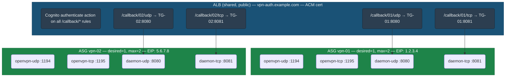
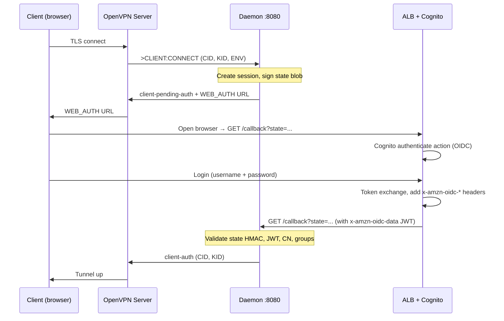
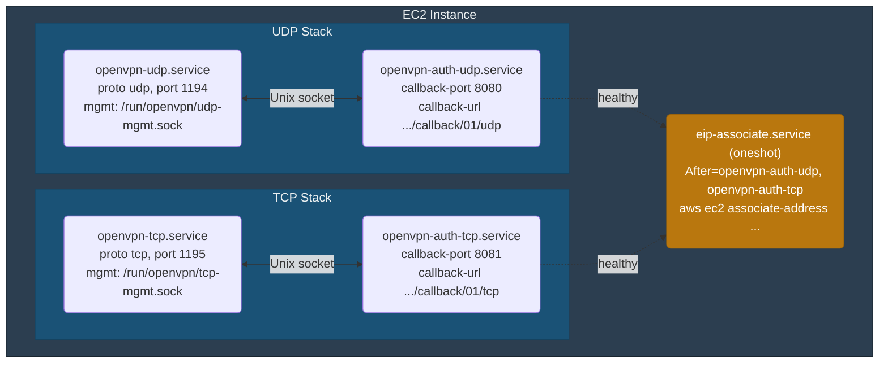
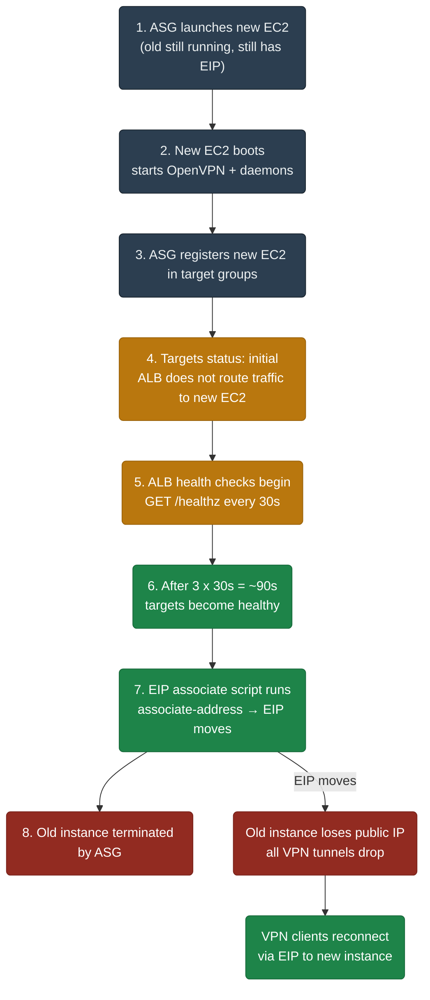
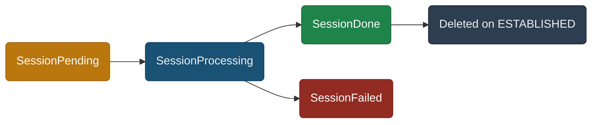
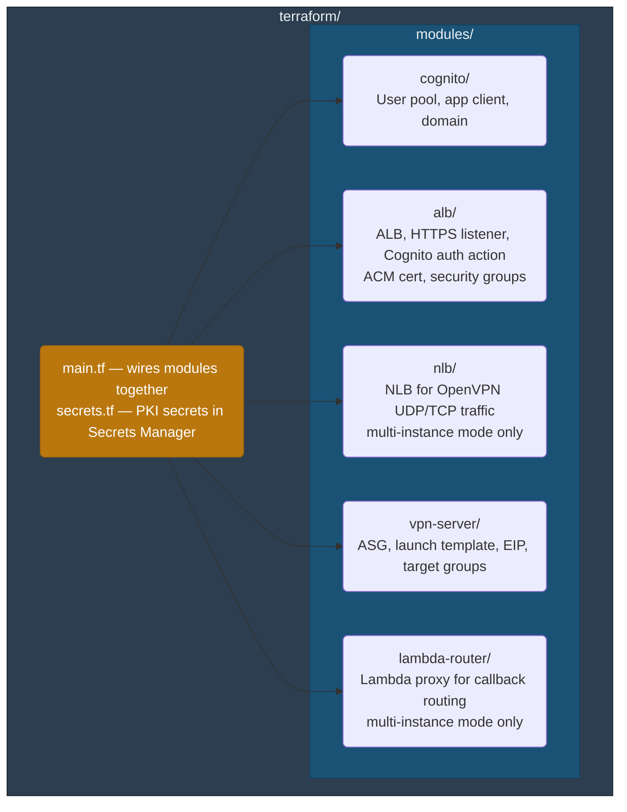

# Architecture — ALB + Cognito

## Overview

The daemon runs on EC2 behind an ALB with Cognito authenticate action. ALB handles the entire OIDC flow — the daemon receives pre-authenticated requests with user claims in ALB headers.

Current implementation summary:

- Single-instance mode: one ASG, static ALB callback paths using `server_name`, EIP enabled
- Multi-instance mode: one ASG, NLB for OpenVPN client traffic, Lambda Router for callback routing by private IP, EIP disabled

All instances run in a single AWS region. Each EC2 instance runs two OpenVPN listeners (UDP + TCP), each with its own auth daemon process.

**Single active target invariant:** In single-instance mode, each daemon target group has exactly one active (healthy) target at any time. `max=2` exists only for ASG replacement mechanics. See [Instance Replacement](#instance-replacement) for details.

## Infrastructure



Terraform modules in the current implementation:

| Count | Module | Purpose |
|-------|--------|---------|
| 1x | `module "cognito"` | User pool, app client, domain |
| 1x | `module "alb"` | Shared ALB, listener, Cognito auth action, security groups |
| 1x | `module "nlb"` | NLB for OpenVPN traffic (multi-instance mode only) |
| 1x | `module "vpn-server"` | ASG + launch template + EIP/target groups in single-instance mode, or ASG attached to NLB in multi-instance mode |
| 1x | `module "lambda-router"` | Lambda proxy for callback routing (multi-instance mode only) |
| — | Root: `secrets.tf` | PKI secrets in Secrets Manager (ca-cert, server-cert, server-key, ta-key) |
| — | Root: `cost_saving_mode` | Skips ALB, EIP, ASG when true (Cognito + secrets preserved) |


## Auth Flow



1. VPN client connects → OpenVPN sends `>CLIENT:CONNECT` via management socket
2. Daemon creates in-memory session, signs a state blob with HMAC, sends `client-pending-auth` with WEB_AUTH URL pointing to the ALB callback path
3. OpenVPN forwards the URL to the client, client opens browser
4. ALB Cognito authenticate action intercepts the request, redirects to Cognito login
5. After login, Cognito redirects back to ALB's internal `/oauth2/idpresponse` endpoint
6. ALB validates the token, restores the **original URL** (`/callback/01/udp?state=...`), adds OIDC headers, forwards to the correct daemon via path-based routing
7. Daemon validates state HMAC, extracts user identity from ALB headers, resolves group membership via Cognito API
8. Daemon sends `client-auth` or `client-deny` to OpenVPN

### WEB_AUTH URL

```text
WEB_AUTH::https://vpn-auth.example.com/callback/01/udp?state=<state_blob>
```

Byte budget (229-byte OpenVPN CE limit):

| Component | Bytes |
|-----------|------:|
| `OPEN_URL:` | 9 |
| `https://vpn-auth.example.com/callback/01/udp?state=` | 52 |
| State blob (base64url JSON + `.` + HMAC-SHA256) | ~162 |
| **Total** | **~223** |
| **Margin** | **~6** |

Short ALB domain and short server names (`01`, `02`) are important to stay within the 229-byte limit.

## ALB Headers

After Cognito authentication, ALB adds these headers to the forwarded request:

| Header                  | Content                                                      |
|-------------------------|--------------------------------------------------------------|
| `x-amzn-oidc-data`     | JWT signed by ALB (ES256). Contains user info endpoint claims (sub, email, etc.). This is NOT the Cognito ID token — it does not contain `cognito:groups`. |
| `x-amzn-oidc-identity` | The `sub` field from the user info endpoint (always `sub`, not email). |
| `x-amzn-oidc-accesstoken` | Cognito access token (plain text).                        |

### JWT Validation

The daemon must validate the `x-amzn-oidc-data` JWT:

1. Extract `kid` from the JWT header
2. Fetch the public key from `https://public-keys.auth.elb.<region>.amazonaws.com/<kid>`
3. Verify ES256 (ECDSA P-256 + SHA-256) signature
4. Validate the `signer` field in the JWT header matches the expected ALB ARN (prevents header spoofing if traffic bypasses ALB)
5. Validate `exp` and `iss` from the JWT header (note: in ALB-signed JWTs, these fields are in the header, not the payload as in standard JWTs)

### Group Membership

Cognito `cognito:groups` is present in the ID token, but ALB does not forward the ID token to the backend. The user info endpoint does not return groups by default.

Two options for resolving group membership:

1. **Cognito API call (simpler):** Daemon calls `AdminListGroupsForUser` using the `sub` from `x-amzn-oidc-identity` as the `Username` parameter. AWS documentation confirms that `sub` is accepted as `Username` for local users; for federated/SAML users this should also work but should be verified empirically. Same approach as reauth flow — consistent, no extra infrastructure. Adds ~10-50ms latency per connect (Cognito API call).

2. **Pre-token generation Lambda trigger (no API call on connect):** Configure a Cognito [pre-token generation Lambda trigger](https://docs.aws.amazon.com/cognito/latest/developerguide/user-pool-lambda-pre-token-generation.html) to inject `cognito:groups` into the access token claims. The daemon then parses groups directly from `x-amzn-oidc-accesstoken` — no Cognito API call needed on the connect path. Trade-offs: requires a Lambda trigger in Cognito, `x-amzn-oidc-accesstoken` is signed by Cognito (not ALB) so validation uses Cognito JWKS instead of ALB public keys, and **access token customization requires Cognito Essentials or Plus feature plan** (`user_pool_tier = "ESSENTIALS"`) with event version V2_0 or V3_0. The Lite plan does not support access token customization.

3. **SAML federation: `custom:groups` attribute mapping (no API call, no Lambda):** When using SAML IdP (Okta, Azure AD, etc.), map the SAML group attribute to a Cognito custom attribute (`custom:groups`). This attribute is returned by the userInfo endpoint and appears in the `x-amzn-oidc-data` JWT — the daemon reads it directly from ALB headers.

   Configuration:

   ```hcl
   resource "aws_cognito_user_pool" "pool" {
     schema {
       name                = "groups"
       attribute_data_type = "String"
       mutable             = true
       string_attribute_constraints {
         max_length = "2048"
       }
     }
   }

   resource "aws_cognito_identity_provider" "saml" {
     # ...
     attribute_mapping = {
       "custom:groups" = "http://schemas.xmlsoap.org/claims/Group"  # depends on IdP
     }
   }
   ```

   Constraints:
   - `custom:groups` is a string, max 2048 chars (Cognito custom string attribute limit) — behavior when the value exceeds this limit is not documented; verify during implementation
   - Value is set at federation (login) — if groups change in IdP, Cognito updates the attribute on next login (which in this flow is every connect, so effectively real-time)
   - `custom:groups` (SAML-mapped attribute) is different from `cognito:groups` (Cognito native groups) — userInfo returns the former but not the latter
   - If Cognito native groups are needed (e.g. for other AWS services), use option 1 (`AdminListGroupsForUser`)
   - The app client used by ALB must have `custom:groups` in `ReadAttributes`. New app clients have read access to all attributes by default, but if permissions are later restricted, `custom:groups` must be explicitly included — otherwise the userInfo endpoint silently omits it

### Network Trust Model

The daemon callback ports (8080/8081) must only be reachable from the ALB. Security group rules:


Without this, an attacker with network access could spoof `x-amzn-oidc-*` headers directly. The ALB JWT `signer` validation is a defense-in-depth check, not a substitute for network isolation.


## Two Daemons per EC2

Each EC2 runs two OpenVPN servers (UDP + TCP), each with its own management socket. Two independent daemon processes handle them:



Each daemon is fully independent — own session store, own mgmt socket connection, own callback port. No shared state between them.

**Invariant:** The path in `--callback-url` must exactly match the ALB listener rule that routes to this daemon's Target Group. A mismatch results in "session not found" because the callback reaches the wrong daemon. The daemon appends `?state=...` to the configured URL — no path construction logic in the daemon.

## Health Check

The daemon exposes a `GET /healthz` endpoint on its callback port. ALB target groups use this for health checks.

| Setting | Value |
|---------|-------|
| Path | `/healthz` |
| Port | traffic-port (8080 or 8081) |
| Interval | 30s |
| Timeout | 5s |
| HealthyThreshold | 3 |
| UnhealthyThreshold | 3 |

Set these values explicitly in Terraform — AWS defaults differ (HealthyThreshold=5, UnhealthyThreshold=2) and may not match the desired behavior.

The `/healthz` endpoint returns:

| Status                    | Condition                                                                        |
|---------------------------|----------------------------------------------------------------------------------|
| `200 OK`                  | Daemon is running and connected to the management socket                         |
| `503 Service Unavailable` | Daemon is running but management socket is disconnected (OpenVPN not ready/crashed) |

Response body (JSON):

```json
{
  "status": "ok",
  "mgmt_connected": true,
  "uptime_seconds": 3600,
  "stored_sessions": 2
}
```

This allows ALB to stop routing callbacks to a daemon whose OpenVPN server is down. The unhealthy threshold (3 consecutive failures x 30s = 90s) provides tolerance for transient mgmt socket reconnections.

ALB Target Group health checks go directly to the target instance, bypassing listener rules and the Cognito authenticate action. No additional ALB rule is needed for `/healthz`.

## Instance Replacement

ASG `desired=1, max=2` means during replacement both old and new instances may briefly coexist in the same Target Group. Since session state is in-memory, this creates a correctness problem: ALB may route a callback to the new instance which has no knowledge of the session.

**Accepted trade-off:** Instance replacement causes a brief auth unavailability window. This is acceptable because:

- VPN tunnels drop anyway when EIP moves — all clients reconnect
- Pending auth sessions on the old instance time out (auth-timeout) and clients retry
- Browser callbacks that land on the new instance get "session not found" — the user re-initiates auth after VPN reconnect
- Replacement is rare (AMI update, instance failure) and the window is short (~60-90s)

**No shared state is needed.** The alternative (DynamoDB/Redis for session state) adds complexity and cost for a scenario that occurs infrequently and self-heals via client reconnection.

### Replacement Sequence



**Note:** ALB may start routing after the first successful check, not after HealthyThreshold. The EIP script waits for full "healthy" status.

**Critical ordering:** EIP must NOT move before ALB considers the new targets healthy. Otherwise VPN clients reconnect, start auth flow, and ALB either has no healthy target or may fail-open to an unhealthy target. By default, ALB fail-opens when the number of healthy targets drops below `minimum_healthy_targets.count` (default: 1) — this is configurable via target group attributes (`target_group_health.unhealthy_state_routing`). The EIP script waits for `healthy` status to avoid both scenarios.

The `eip-associate.service` script polls target health before associating (see [EIP Management](#eip-management)).

### Readiness Chain

The `/healthz` endpoint acts as a readiness probe for the entire stack. EIP association is gated on ALB healthy status, which implies the full dependency chain is satisfied:


If OpenVPN is slow to start, the daemon retries the management socket connection (built-in reconnect loop). During this time `/healthz` returns 503, ALB keeps the target in `initial`/`unhealthy` state, and EIP does not move. No additional sleep or readiness probes are needed — the health check endpoint is the readiness probe.


## EIP Management

Each ASG has a pre-allocated EIP. The EC2 instance associates it on boot via a systemd oneshot unit that runs after both daemons are ready:

```bash
#!/bin/bash
# /usr/local/bin/associate-eip.sh
set -euo pipefail

TOKEN=$(curl -s -X PUT "http://169.254.169.254/latest/api/token" \
  -H "X-aws-ec2-metadata-token-ttl-seconds: 300")
INSTANCE_ID=$(curl -s -H "X-aws-ec2-metadata-token: $TOKEN" \
  http://169.254.169.254/latest/meta-data/instance-id)

# Wait for this instance to be healthy in both target groups before
# associating EIP. Without this, reconnecting clients may hit a target
# that is not yet healthy, or ALB may fail-open if no healthy targets exist.
MAX_WAIT=300  # 5 minutes
ELAPSED=0

for TG_ARN in ${TG_UDP_ARN} ${TG_TCP_ARN}; do
  echo "Waiting for healthy status in TG: ${TG_ARN}"
  while true; do
    if [ ${ELAPSED} -ge ${MAX_WAIT} ]; then
      echo "ERROR: Timed out after ${MAX_WAIT}s waiting for healthy target in ${TG_ARN}" >&2
      exit 1
    fi
    STATE=$(aws elbv2 describe-target-health \
      --target-group-arn "${TG_ARN}" \
      --targets "Id=${INSTANCE_ID}" \
      --query 'TargetHealthDescriptions[0].TargetHealth.State' \
      --output text)
    if [ "${STATE}" = "healthy" ]; then
      echo "Target healthy in ${TG_ARN}"
      break
    fi
    echo "Target state: ${STATE}, retrying in 10s..."
    sleep 10
    ELAPSED=$((ELAPSED + 10))
  done
done

aws ec2 associate-address \
  --instance-id "$INSTANCE_ID" \
  --allocation-id "${EIP_ALLOC_ID}" \
  --allow-reassociation

echo "EIP ${EIP_ALLOC_ID} associated with ${INSTANCE_ID}"
```

`EIP_ALLOC_ID`, `TG_UDP_ARN`, and `TG_TCP_ARN` are injected via the launch template (environment file written by user-data).

`--allow-reassociation` atomically moves the EIP from the old instance (if any) to the new one. During ASG instance replacement, VPN clients on the old instance lose connectivity and reconnect to the new instance automatically.

IAM permissions required on the instance role:

```json
[
  {
    "Effect": "Allow",
    "Action": "ec2:AssociateAddress",
    "Resource": [
      "arn:aws:ec2:<region>:<account-id>:elastic-ip/<eip-alloc-id>",
      "arn:aws:ec2:<region>:<account-id>:instance/*"
    ],
    "Condition": {
      "StringEquals": {
        "aws:ResourceTag/Project": "openvpn"
      }
    }
  },
  {
    "Effect": "Allow",
    "Action": "elasticloadbalancing:DescribeTargetHealth",
    "Resource": "*"
  },
  {
    "Effect": "Allow",
    "Action": [
      "cognito-idp:AdminGetUser",
      "cognito-idp:AdminListGroupsForUser"
    ],
    "Resource": "arn:aws:cognito-idp:<region>:<account-id>:userpool/<user-pool-id>"
  }
]
```

Notes:
- Each ASG's instance role should only reference its own EIP allocation ID. The `instance/*` resource is scoped by the `Project` tag condition to prevent associating the EIP with arbitrary instances.
- `DescribeTargetHealth` does not support resource-level permissions — `Resource: "*"` is required. The EIP script limits which TG ARNs it queries via environment variables (`TG_UDP_ARN`, `TG_TCP_ARN`), not IAM.
- Cognito permissions are scoped to the specific User Pool ARN.

## Routing — Why Path-Based

Each VPN server has a short name (`01`, `02`, etc.) assigned in Terraform. The callback URL path encodes the server name and protocol:

```text
/callback/{server_name}/{proto}
```

ALB listener rules are static — defined in Terraform at plan time, not dynamically created by lifecycle hooks. Adding a new VPN server means adding a new `module "vpn-server"` block and corresponding ALB rules.

Cognito app client needs only one callback URL: `https://vpn-auth.example.com/oauth2/idpresponse` (ALB's internal OIDC endpoint). No per-server callback URLs in Cognito.

### Constraints

- **Cognito User Pool should be in the same region as the ALB** when using `authenticate-cognito` action. The action takes `user_pool_arn` and `user_pool_domain` but has no parameter for a cross-region endpoint — ALB likely resolves Cognito endpoints based on the ARN region. This is operationally expected but not explicitly confirmed in AWS documentation; verify empirically if cross-region is needed. If a central Cognito in a different region is required, use `authenticate-oidc` action instead — this allows explicit endpoint configuration but requires a client secret and loses the native Cognito integration.
- **Cognito app client must have a client secret** and use the authorization code grant flow (required by ALB Cognito integration).
- **Cognito domain is required** — ALB `authenticate-cognito` action needs `user_pool_domain` to construct the authorization URL. Either a Cognito-hosted domain (`xxx.auth.<region>.amazoncognito.com`) or a custom domain.
- **OAuth scope must include `email`** if the daemon needs the user's email from `x-amzn-oidc-data` claims. ALB defaults to `openid` only. Configure `scope = "openid email"` in the `authenticate_cognito` action block. `openid` enables OIDC login, `email` requests the `email` claim from Cognito userInfo so ALB can include it in `x-amzn-oidc-data`. Add `profile` if additional claims are needed.
- **ALB auth session timeout should be short-lived** — after successful Cognito login, ALB stores session state in `AWSELBAuthSessionCookie-*` cookies. These cookies are independent of the daemon's short-lived `state` parameter. Keep `session_timeout` modest (default in this repo: `1h`) so old callback URLs stop reaching the daemon through an existing ALB browser session sooner. The timeout is configured in Terraform via `alb_auth_session_timeout_hours`.

## Session Lifecycle



The session store is in-memory per daemon. No shared state between daemons or instances.

## Local Development

**Three-terminal setup (no Docker):**

| Terminal | Command | Notes |
|----------|---------|-------|
| 1 | `make run-mgmt-mock` | OpenVPN management socket simulator |
| 2 | `make run-daemon` | `--cognito-groups-from-claims`, `--cognito-skip-reauth`, no `--alb-arn` |
| 3 | `make run-alb-mock` | ALB + Cognito simulator |

**Docker stack:**


In mgmt-mock terminal: `connect 1 user@example.com`

### `alb-mock`

Simulates ALB + Cognito authenticate action. On receiving a request:

1. `GET /callback/{server}/{proto}?state=<blob>` — verifies HMAC on state
2. Parses `{proto}` from the request path to determine which daemon port to forward to (`udp` → 8080, `tcp` → 8081)
3. Adds fake ALB headers to the request:

   | Header | Value |
   |--------|-------|
   | `x-amzn-oidc-data` | unsigned JWT with test claims |
   | `x-amzn-oidc-identity` | `test-user-sub-uuid` |
   | `x-amzn-oidc-accesstoken` | `mock-access-token` |

4. Forwards to daemon's callback port

The mock skips actual Cognito login — it auto-authenticates with a configurable test identity (email, sub, groups via env vars). The routing logic (path → port) lives only in alb-mock, not in the daemon.

### Config-driven local behavior

The daemon infers local dev behavior from its configuration — no hidden mode switch:

| Config state | Behavior |
|---|---|
| `--alb-arn` omitted | Skip ALB JWT signature and `signer` validation (accepts unsigned JWTs from alb-mock) |
| `--hmac-secret` set (no `--hmac-secret-arn`) | Use local HMAC secret, skip Secrets Manager |
| `--cognito-user-pool-id` omitted | Use static identity checker automatically — no AWS credentials needed |
| `--cognito-groups-from-claims` | Read groups from `x-amzn-oidc-data` JWT claims instead of calling `AdminListGroupsForUser`. Use with SAML `custom:groups` mapping or in local dev. |
| `--cognito-skip-reauth` | Skip `AdminGetUser` call on reauth — auto-approve renegotiation without verifying user status in Cognito. |

**Always active regardless of config:** state HMAC validation, session lifecycle, CN cross-check (if enabled).

Local dev Makefile target:

```bash
run-daemon:
    go run ./cmd/openvpn-auth-daemon \
        --cn-cross-check=false \
        --hmac-secret=test-secret-key!! \
        --callback-url=http://localhost:8080/callback \
        --cognito-skip-reauth \
        --cognito-groups-from-claims \
        --management-socket=/tmp/openvpn-mgmt.sock \
        --management-password-file=/tmp/mgmt-pw \
        --callback-port=8081 \
        --auth-timeout=120s \
        --hand-window=120s
```

### `callback/server.go` endpoints

| Endpoint | Flow |
|----------|------|
| `GET /callback/{path...}?state=<blob>` | validate state HMAC → lookup session by SID → read `x-amzn-oidc-data` JWT → validate ALB signature (skip if no `--alb-arn`) → extract email/sub from claims → resolve groups → CN cross-check, group check → `client-auth` / `client-deny` |
| `GET /healthz` | returns 200/503 based on mgmt socket status |

### `docker-compose.yml`

```yaml
services:
  openvpn:
    # unchanged

  daemon:
    environment:
      - VPN_AUTH_CN_CROSS_CHECK=false
      - VPN_AUTH_HMAC_SECRET=test-secret-key!!
      - VPN_AUTH_CALLBACK_URL=http://localhost:8080/callback/01/udp
      - VPN_AUTH_COGNITO_SKIP_REAUTH=true
      - VPN_AUTH_COGNITO_GROUPS_FROM_CLAIMS=true
      - VPN_AUTH_MANAGEMENT_SOCKET=/run/openvpn/management.sock
      - VPN_AUTH_MANAGEMENT_PASSWORD_FILE=/etc/openvpn/management-pw
      - VPN_AUTH_CALLBACK_PORT=8081
      - VPN_AUTH_SERVER_NAME=lab-dev
      # no VPN_AUTH_ALB_ARN → skips JWT validation

  alb-mock:
    build:
      context: ..
      dockerfile: lab/Dockerfile.alb-mock
    ports:
      - "8080:8080"
    environment:
      - DAEMON_ADDR=daemon:8081
      - MOCK_EMAIL=test@example.com
      - MOCK_SUB=test-sub-123
      - MOCK_GROUPS=vpn-users
```

`VPN_AUTH_CALLBACK_URL` is the URL the daemon puts into WEB_AUTH — the browser opens it. In Docker, `localhost:8080` hits alb-mock (via port mapping), which adds `x-amzn-oidc-*` headers and forwards to `daemon:8081` (docker-internal).

There is no hybrid mode (local daemon + real AWS ALB) because ALB requires targets in a VPC — it cannot reach a locally-running daemon. For real OIDC testing, deploy the full Terraform stack.

### Testing with real AWS Cognito

Testing the full ALB + Cognito flow requires deploying the Terraform stack. No local simulation is possible because ALB `authenticate-cognito` is a managed AWS service and ALB cannot reach a locally-running daemon.

```bash
cd terraform
terraform apply   # deploy full stack (Cognito + ALB + VPN server)
# Create DNS CNAME: vpn-auth.example.com → ALB DNS name
# Connect with OpenVPN client pointing to the EIP
```

See [testing.md](testing.md) for a detailed comparison of what each mode covers.

## Terraform Module Structure



Key toggles:
- `cost_saving_mode = true` — skips ALB, NLB, EIP, and ASG; preserves Cognito and PKI secrets
- `multi_instance_mode = true` — enables NLB and Lambda Router, disables EIP and static ALB listener rules
## Historical Alternative: Per-Server ASGs

An earlier design option used multiple independent VPN server stacks, where each logical server had its own ASG, its own EIP, and static ALB callback rules such as `/callback/01/udp`, `/callback/02/tcp`.

That model is useful to remember because it explains some of the path-based callback examples in this document and the earlier thinking around server identity encoded in callback URLs.

Why it was attractive:

- Clear ownership per VPN server
- Static path-based callback routing with predictable server names
- Simple mental model for EIP movement during instance replacement

How target group registration would work in that model:

- Each per-server ASG would attach directly to its own pair of daemon target groups, one for UDP daemon callbacks and one for TCP daemon callbacks
- Instances launched by that ASG would be registered automatically in those target groups through the ASG `target_group_arns` setting
- ALB listener rules for `/callback/<server_name>/udp` and `/callback/<server_name>/tcp` would forward only to that server's target groups
- During replacement, the old and new instances could briefly coexist in the same per-server target groups until the new instance became healthy and the EIP moved

Why it is not the current implementation:

- More infrastructure duplication across otherwise similar server stacks
- More static ALB rule management as the number of servers grows
- Poorer fit for the current multi-instance model, where callback routing is based on private IP and handled by Lambda Router

The current repository instead uses a single `module "vpn_server"` and switches behavior with `multi_instance_mode`.

## Historical Alternative: Dynamic ALB Path Rules Without Lambda Router

Another design option for multi-instance deployments kept a single shared ASG, but avoided Lambda Router by creating dynamic ALB path rules for each instance at runtime.

In that model:

- each EC2 instance would derive a stable callback identity at boot, for example from instance ID or private IP
- the instance lifecycle automation would create ALB listener rules such as `/callback/<instance-id>/udp` and `/callback/<instance-id>/tcp`
- each rule would forward to instance-specific daemon target groups, or to shared target groups with explicit target registration for that instance
- the daemon callback URL would be generated per instance to match those runtime-created ALB paths

How target registration would work in that model:

- the replacement workflow would need control-plane automation to create or update listener rules and target groups when instances launch
- the new instance would need to be registered in the correct daemon callback target groups before its callback URLs became usable
- instance termination would need cleanup of listener rules, target registrations, and possibly target groups to avoid stale ALB configuration

Why this approach was considered:

- it preserved path-based routing all the way to the daemon, without introducing an extra request proxy hop
- callback URLs could still encode instance identity directly
- it fit naturally with the existing ALB authenticate-cognito flow

Why it is not the current implementation:

- significantly more lifecycle orchestration was required around ASG scale-out and replacement
- ALB listener rule management becomes operationally heavier as instance churn increases
- rule priority allocation, cleanup, and eventual consistency become part of the critical path
- Lambda Router with a single static `/callback/*` rule is simpler and better aligned with one-ASG multi-instance mode
