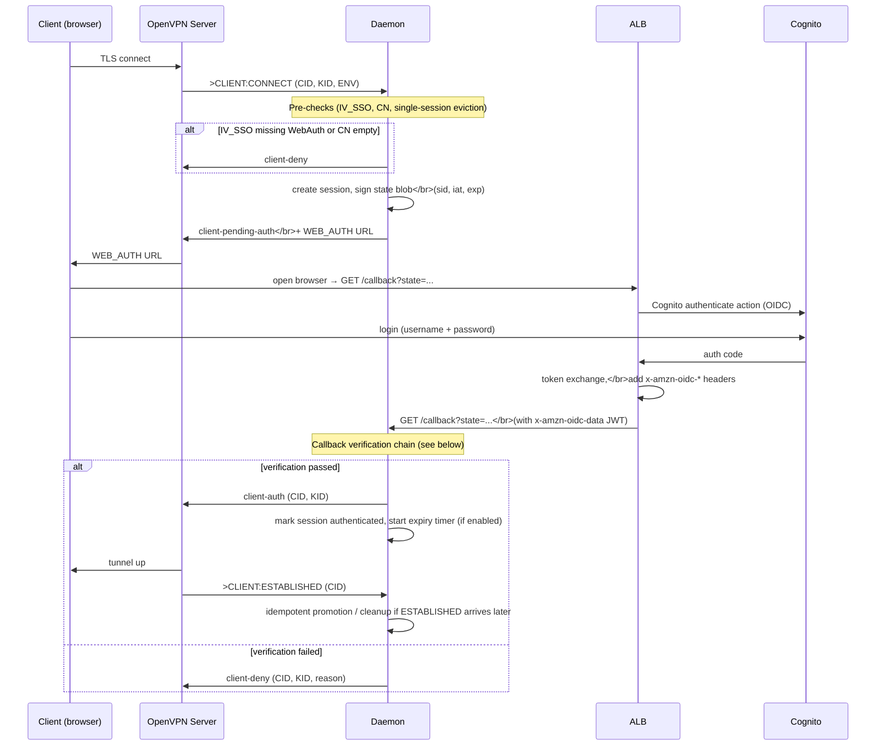
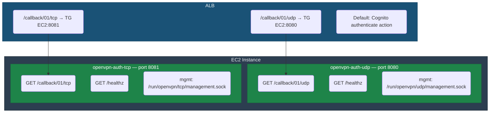
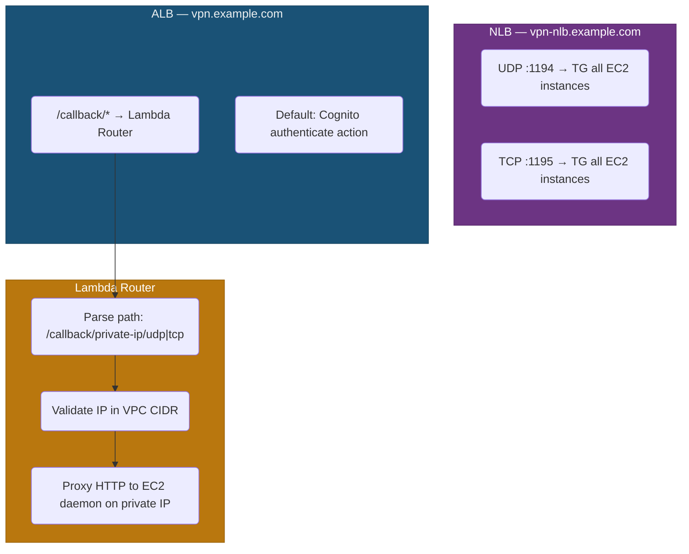
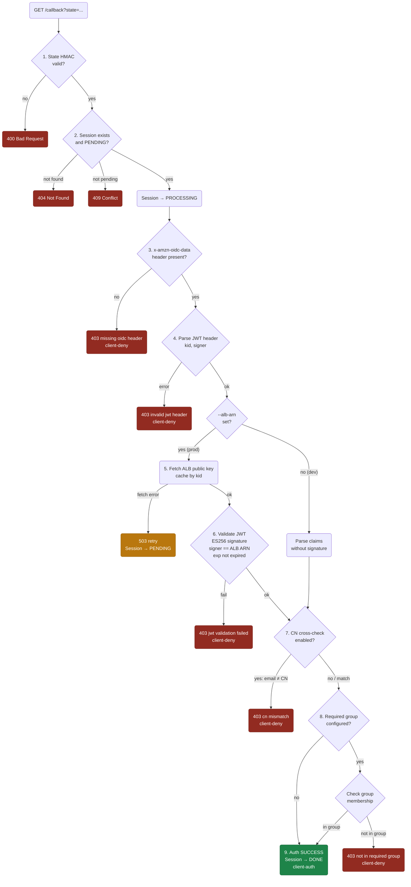
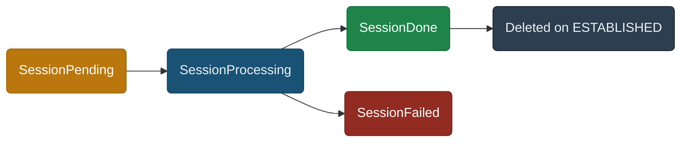
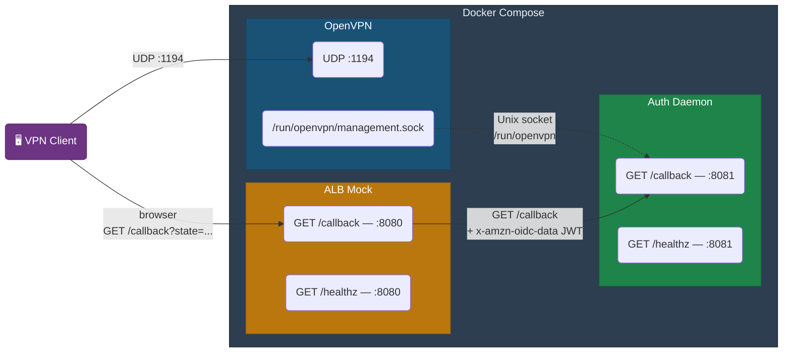

# Architecture

OpenVPN auth daemon that authenticates OpenVPN clients via browser-based OIDC with AWS Cognito. The daemon connects to OpenVPN's Unix management socket, receives client events, and drives authentication through an ALB with a Cognito authenticate action — no Lambda or API Gateway required.

## Auth Flow



### Pre-checks

Before starting the OIDC flow, the daemon validates the `CLIENT:CONNECT` event:

- **IV_SSO check** — client must advertise `webauth` or `openurl` in the `IV_SSO` env variable; otherwise `client-deny` with reason `"client does not support WebAuth"`
- **Common Name** — certificate CN must be non-empty; otherwise `client-deny` with reason `"missing common name"`
- **Single-session eviction** — when `--single-session-per-user=true` (default), if a session for the same CN already exists, the old session is evicted (`client-deny` for pending, `client-kill` for established) before creating a new one

### Steps

1. VPN client connects → OpenVPN sends `>CLIENT:CONNECT` to management socket
2. Daemon runs pre-checks, creates an in-memory session, signs a state blob (`sid`, `iat`, `exp`), sends `client-pending-auth` with WEB_AUTH URL: `{--callback-url}?state={blob}`
3. OpenVPN forwards the URL to the client; client opens browser
4. ALB intercepts the request, runs the Cognito authenticate action (full OIDC flow), then forwards the authenticated request to the daemon's callback port with `x-amzn-oidc-*` headers
5. Daemon runs the [callback verification chain](#callback-verification-chain) — state HMAC, session transition, ALB JWT signature (ES256), CN cross-check, group membership
6. Daemon sends `client-auth` (success) or `client-deny` (failure) to OpenVPN

## Two Daemons per EC2

Each EC2 instance runs two independent daemon processes — one for UDP, one for TCP. They have separate management sockets, callback ports, and session stores with no shared state.

## Management Socket Bootstrap

On every management socket connection, the daemon performs a short bootstrap phase before it starts handling live `>CLIENT:*` events.

Sequence:

1. Connect to the OpenVPN management Unix socket
2. Authenticate with the management password
3. Send `hold release`
4. Send `status 3`
5. Parse the current OpenVPN snapshot (`HEADER`, `CLIENT_LIST`, `ROUTING_TABLE`, `GLOBAL_STATS`, `END`)
6. Rebuild in-memory session tracking from the live OpenVPN state
7. Enter the normal event loop and process new `>CLIENT:CONNECT`, `>CLIENT:REAUTH`, `>CLIENT:DISCONNECT`, `>CLIENT:ESTABLISHED` events

This happens not only at daemon startup, but also after any management reconnect, for example:

- daemon restart
- OpenVPN restart
- temporary management socket disconnect
- parser or socket read error that forces a reconnect

The purpose of bootstrap is to resynchronize daemon memory with the actual OpenVPN state. The daemon keeps some session-tracking data in memory, so after reconnect it must rebuild that state from `status 3` before it can safely process new client events.

Bootstrap uses a short read timeout for the `status 3` snapshot. This prevents the daemon from hanging for minutes if OpenVPN is in the middle of a restart and the management socket accepts a connection but does not finish the snapshot.

If bootstrap fails or times out, the daemon reconnects and retries. In that state OpenVPN may still be running, but the daemon is not yet ready to process live `CLIENT:CONNECT` events because it has not completed the initial state sync.

Observed behavior during OpenVPN restart:

- the first bootstrap attempt may time out while the new OpenVPN process is still coming up
- the next reconnect attempt usually succeeds immediately
- once bootstrap completes, the daemon resumes normal client handling

From the VPN client's point of view, a UDP-based OpenVPN server restart may not appear as an explicit "session terminated" event. Instead, the client often observes missing replies, repeated `PUSH_REQUEST` retries, and then a soft restart/reconnect once its own timeout logic fires.

Similarly, when a UDP client process exits locally, the server may observe repeated `ECONNREFUSED` reads before it finally declares the peer dead via `--ping-restart`. In that case the daemon may receive `>CLIENT:DISCONNECT` only when OpenVPN reaches the inactivity timeout, not immediately when the client exits.

### Single-instance mode (default)

Static ALB listener rules route callbacks by server name:



### Multi-instance mode

When `multi_instance_mode = true`, multiple EC2 instances run behind an NLB for OpenVPN client traffic and a Lambda Router for callback routing:



Each EC2 instance uses its private IP in the callback URL (e.g. `/callback/10.0.1.42/udp`). The Lambda Router extracts the IP from the path, validates it against the VPC CIDR, and proxies the request directly to the daemon. See [Lambda Router](lambda-router-proxy.md) for details.

## Callback Verification Chain

When the daemon receives `GET /callback` from the ALB, it runs a multi-step verification pipeline. Every step must pass — failure at any point results in `client-deny`. The flow is implemented in `internal/callback/server.go:handleCallback`.



### Step-by-step

| # | Check | What it protects against | Failure | Metric reason |
|---|-------|--------------------------|---------|---------------|
| 1 | **State HMAC** — `DecodeState` verifies the HMAC-SHA256 signature on the `state` query parameter, checks `iat`/`exp`. **Note:** if state is invalid, the daemon cannot extract the session ID, so it cannot send `client-deny` — the VPN client waits until `--auth-timeout` expires. This is a UX limitation, not a security issue. | CSRF, forged callbacks, replay after expiry | 400 | `missing_state` / `invalid_state` |
| 2 | **Session lookup** — `TryProcess` atomically transitions session from `PENDING` → `PROCESSING` | Replay (double callback), race conditions | 404 / 409 | `session_not_found` / `session_not_pending` |
| 3 | **OIDC header** — checks `x-amzn-oidc-data` header is present | Direct access bypassing ALB | 403 + deny | `missing_oidc_header` |
| 4 | **JWT header parse** — extracts `kid` and `signer` from the JWT header segment | Malformed tokens | 403 + deny | `invalid_jwt_header` |
| 5 | **ALB public key fetch** — fetches ECDSA public key from `https://public-keys.auth.elb.{region}.amazonaws.com/{kid}`, cached in memory | N/A (infrastructure step) | 503 (retryable) | `public_key_fetch_failed` |
| 6 | **JWT signature + claims** — verifies ES256 signature with the ALB public key, checks `signer` matches `--alb-arn`, requires valid `exp` | Token forgery, ALB spoofing, expired tokens | 403 + deny | `jwt_validation_failed` / `invalid_jwt_claims` |
| 7 | **CN cross-check** — compares JWT `email` claim with the client certificate's Common Name (case-insensitive) | User A authenticating with User B's browser session | 403 + deny | `cn_mismatch` |
| 8 | **Group membership** — checks if the user belongs to the required Cognito group (via JWT claim such as `custom:groups` when explicitly mapped, or via Cognito Admin API) | Unauthorized access by authenticated but unprivileged users | 403 + deny | `group_check_error` / `group_denied` |

All rejection reasons are emitted as `CallbackRejected` EMF metric with a `Reason` dimension. See [EMF Metrics](configuration.md#emf-metrics) for the full list.

### Production vs dev mode

In production (`--alb-arn` is set), steps 5-6 enforce full cryptographic verification of the ALB JWT. The daemon only trusts tokens signed by the specific ALB identified by its ARN.

In dev mode (`--alb-arn` is absent), JWT signature validation is skipped — claims are parsed from the token payload without verification. This mode should never be used in production. All other checks (state HMAC, session, CN cross-check, groups) still apply.

### Network-level defense

The callback port is only reachable from the ALB security group (no public ingress). JWT validation provides defense-in-depth — even if network isolation were compromised, an attacker would need a valid JWT signed by the correct ALB.

## ALB JWT Validation

See [AWS docs: Authenticate users using an Application Load Balancer](https://docs.aws.amazon.com/elasticloadbalancing/latest/application/listener-authenticate-users.html) for the full ALB authenticate action reference.

Before the daemon sees a normal callback request, the ALB's `authenticate-cognito` action performs the browser login flow with Cognito and stores its own session in `AWSELBAuthSessionCookie-*` cookies. In the currently tested setup with native Cognito users (`supported_identity_providers = ["COGNITO"]`), the forwarded request contained these headers:

- `x-amzn-oidc-data` — ES256-signed JWT from ALB. In the tested Cognito flow its payload contained `email`, `sub`, `username`, `exp`, `iss`.
- `x-amzn-oidc-identity` — plain-text copy of the user `sub`.
- `x-amzn-oidc-accesstoken` — raw Cognito access token. In the tested flow its payload contained `sub`, `username`, `scope`, `client_id`, `token_use`, `auth_time`, `exp`, `iat`, `iss`, `jti`, `origin_jti`, `version`.

Important details from production logs for the native-Cognito flow:

- `x-amzn-oidc-data` contained `username`, not `cognito:username`
- for native Cognito users in this deployment, `username` was a UUID-like internal Cognito username, while `email` remained a separate attribute
- `x-amzn-oidc-data` did not contain `cognito:groups`
- `x-amzn-oidc-accesstoken` also did not contain `cognito:groups`
- adding a user to a Cognito User Pool group did not make that group appear automatically in `x-amzn-oidc-data` for this ALB `authenticate-cognito` flow
- adding a user to a Cognito User Pool group also did not make that group appear automatically in `x-amzn-oidc-accesstoken`
- because of that, the daemon must treat `username` as the fallback lookup key for `AdminGetUser`
- group checks from JWT claims only work when claims are explicitly made available in the ALB-forwarded token; in this native-Cognito deployment they were absent from both forwarded JWTs

These observations are empirical for the current native-Cognito deployment. External IdP federation through Cognito may produce different forwarded claims and should be verified separately.

In Terraform this repo configures:

- `scope = "openid email"` so Cognito returns the user's `email` claim and ALB can include it in `x-amzn-oidc-data`
- `session_timeout` via `alb_auth_session_timeout_hours` (default `1h`) so the ALB browser session does not outlive the short-lived daemon `state` by too much

These ALB cookies are separate from the daemon's `state` parameter. A browser may still have a valid ALB auth session while the callback `state` has already expired; in that case the request reaches the daemon and is correctly rejected as `invalid_state`.

ALB signs the `x-amzn-oidc-data` header with ES256 (ECDSA P-256 + SHA-256). On first use of each `kid`, the daemon fetches the public key from:

```
https://public-keys.auth.elb.{region}.amazonaws.com/{kid}
```

Keys are cached in memory for the process lifetime. The daemon verifies:

- ES256 signature using the fetched public key
- `signer` field in the JWT header matches `--alb-arn`
- `exp` and `iss` fields in the JWT payload

If `--alb-arn` is absent, signature validation is skipped (dev/test only — never in production).

## WEB_AUTH URL Length Constraints

OpenVPN CE clients have a hard limit of ~229 usable bytes for the WEB_AUTH URL (the `alloc_buf_gc(256)` buffer in `src/openvpn/push.c`, after the `>INFOMSG:` prefix). If exceeded, the client silently drops the message and the browser never opens.

The daemon checks `len("OPEN_URL:") + len(authURL)` at runtime for every `CLIENT:CONNECT`. If the limit is exceeded, it sends `client-deny` with reason `"auth URL too long"` rather than silently failing.

At startup, the daemon also estimates the worst-case URL length from `--callback-url` and logs a warning if it is likely to exceed the limit.

### Byte budget

| Component | Bytes |
|-----------|------:|
| `OPEN_URL:` | 9 |
| `https://<domain>/callback/01/udp?state=` | 45-65 (varies by domain) |
| State blob: base64url(JSON payload, ~60 bytes) | ~80 |
| `.` separator | 1 |
| HMAC-SHA256 (32 bytes) base64url, no padding | 43 |
| **Total** | **178-198** |
| **229-byte limit** | **229** |

Keep `--callback-url` short. A custom domain (e.g. `vpn-auth.example.com`) is recommended over long auto-generated hostnames.

## Health Check Endpoint

Each daemon exposes `GET /healthz` on its callback port. The endpoint returns:

- **200** with `{"status":"ok","mgmt_connected":true,"uptime_seconds":N,"stored_sessions":N}` when the management socket is connected
- **503** with `{"status":"degraded","mgmt_connected":false,...}` when disconnected

ALB target group health checks use this endpoint (path `/healthz`, interval 30s, timeout 5s, healthy threshold 3). EIP association is gated on both target groups reaching healthy state — see [EIP Association](#eip-association) below.

No authentication is required on `/healthz`.

## EIP Association

> **Note:** EIP association is used only in single-instance mode (`multi_instance_mode = false`). In multi-instance mode, instances have no EIPs — OpenVPN client traffic reaches instances through the NLB.

Each VPN server has a pre-allocated Elastic IP. After an instance replacement, the `eip-associate.service` systemd unit:

1. Starts after both `openvpn-auth-udp.service` and `openvpn-auth-tcp.service` are active
2. Polls `elasticloadbalancing:DescribeTargetHealth` for both target groups until the instance is `healthy` (300s timeout)
3. Calls `ec2:AssociateAddress --allow-reassociation` to atomically move the EIP from the old instance

This ensures VPN clients reconnecting after an instance replacement always reach a fully ready daemon.

## Session Lifecycle



- **SessionPending** — created on `>CLIENT:CONNECT`, waiting for browser callback
- **SessionProcessing** — callback received, identity checks in progress (atomic transition prevents double-processing)
- **SessionDone** — auth successful, `client-auth` sent; deleted as soon as auth success is promoted, so a missed `>CLIENT:ESTABLISHED` does not lose max-session tracking
- **SessionFailed** — auth failed (timeout, JWT validation error, group check failed), `client-deny` sent

Sessions that never reach `ESTABLISHED` have a TTL of `2 × hand-window` and are reaped automatically.

### Management Socket Reconnect and Session Tracking

On each management socket connect, the daemon sends `hold release` followed by `status 3`. OpenVPN responds with a snapshot of all currently established clients. The daemon uses this snapshot to rebuild its in-memory session tracking maps (`cidToCN`, `cnToActiveCID`, `cidToExpiry`) — a process handled by `RebuildSessionTrackingFromStatus`.

This covers three scenarios:

| Scenario | What happens |
| --- | --- |
| **Daemon restart** (OpenVPN still running) | Daemon starts with empty maps. `status 3` returns all active clients. Maps are populated from scratch — `single-session-per-user` and `max-session-duration` enforcement resume for existing sessions. |
| **Management socket drops** (both still running) | Daemon reconnects to the socket. Maps may contain stale entries for clients that disconnected while the socket was down. `status 3` returns the current state — stale entries are pruned, surviving sessions are kept or have their expiry timers restarted. |
| **OpenVPN restart** | All VPN tunnels are terminated. `status 3` returns an empty list. All map entries and expiry timers are cleaned up. Clients must reconnect (new `CLIENT:CONNECT`), so tracking starts fresh. |

When `--max-session-duration` is disabled (`0`), `RebuildSessionTrackingFromStatus` still rebuilds `cidToCN` and `cnToActiveCID` so that `--single-session-per-user` eviction works correctly after a reconnect. Expiry timer logic is simply skipped.

## Auth Timeout vs Hand-Window

- `hand-window` (OpenVPN server directive) — total time OpenVPN allows for the TLS handshake including auth
- `--auth-timeout` (daemon flag) — how long the daemon waits for the browser callback before sending `client-deny`

`auth-timeout` must be **less than** `hand-window`. If equal, the daemon's `client-deny` races with OpenVPN's own timeout, causing the client to receive a `no-push-reply` soft restart instead of `AUTH_FAILED`.

Recommended values:

```text
hand-window 300        # OpenVPN server config
--auth-timeout 270s    # daemon (hand-window minus ~30s)
```

## Session Eviction

When `--single-session-per-user=true` (default), only one active session per certificate CN is allowed:

- **New connect with same CN while pending** — old session cancelled, `client-deny` sent for old CID
- **New connect with same CN while established** — old session killed, `client-kill` sent for old CID
- **Disconnect** — session tracking cleaned up, CN slot freed

> **Multi-instance limitation:** Session tracking is in-memory and local to each daemon instance. In multi-instance (ASG) mode, `--single-session-per-user` only enforces the limit within a single instance — a user can hold concurrent sessions on different instances. See [Single-Session-Per-User in Multi-Instance Mode](multi-instance-single-session.md) for a proposed fix using a DynamoDB shared session store.

## Reauth Flow

OpenVPN triggers `>CLIENT:REAUTH` on TLS renegotiation (controlled by `reneg-sec`). The daemon:

1. Looks up user by CN in Cognito (`AdminGetUser`)
2. Checks user exists, is enabled, and optionally is in the required group
3. Sends `client-auth-nt` (allow) or `client-deny` (deny)

Reauth results can be cached (`--reauth-cache=true`) to survive brief Cognito outages. The reauth flow does not depend on ALB headers or the callback server.

**Federated users:** For federated Cognito users the certificate CN does not match the Cognito username (which has the form `providerName_externalId`). At authentication time the daemon stores the Cognito lookup username from the ALB callback claims alongside the session, preferring `cognito:username` when present and falling back to `username`. It then uses that stored value — rather than the CN — when calling `AdminGetUser` on reauth. See [Cognito Federation](cognito-federation.md) for known limitations with federated identities.

## Docker Compose Stack


