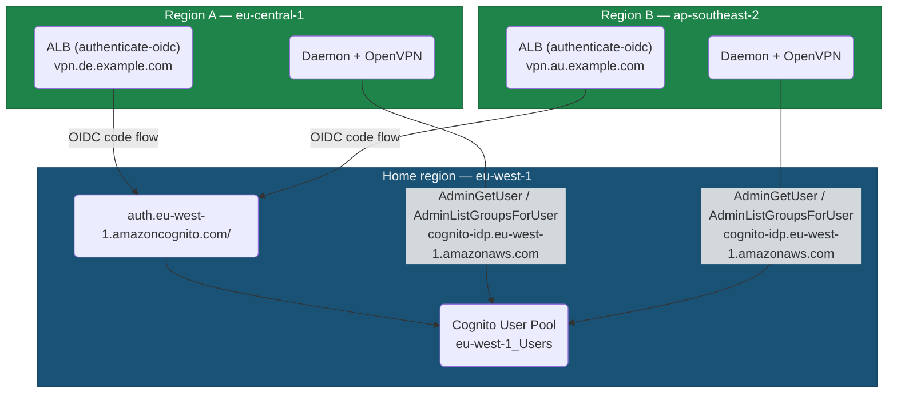

# Cross-Region Cognito

> ⚠️ **VALIDATION NOTES AND TARGET ARCHITECTURE — NOT IMPLEMENTED**
>
> This document captures cross-region Cognito design notes, AWS documentation findings, remaining uncertainties, and target architecture decisions. The Terraform in this repository does not currently implement this mode, and daemon region overrides such as `--cognito-region` and `--secretsmanager-region` are target pre-release work unless implemented elsewhere. Treat `authenticate-oidc` against remote Cognito as a design direction that still requires a real AWS validation run, especially for ALB-forwarded claim shape. Keep primary operational setup guidance in [Configuration](configuration.md), [Architecture](architecture.md), and the Terraform module docs; do not cite this file as complete documentation of current runtime behavior.

This document covers deployments where a single Cognito User Pool lives in one region (the "home region") and one or more ALBs plus auth daemons live in other regions. The goal is to keep Cognito as a single source of truth for identities, groups, and federated IdP configuration across a multi-region OpenVPN fleet, without replicating the User Pool per region.

It is not the default mode in this repo's Terraform — `module "cognito"` provisions a User Pool co-located with the ALB. This page describes what works, what does not, and what you have to build yourself.

## Why this is not trivial

The ALB `authenticate-cognito` action takes `user_pool_arn`, `user_pool_client_id`, and `user_pool_domain`; it does not accept explicit authorization, token, or userInfo endpoint URLs. AWS documents the action and its supported regions, but does not document cross-region Cognito usage for this action. Treat cross-region `authenticate-cognito` as unsupported/uncertain and do not build on it.

The viable cross-region path is ALB's `authenticate-oidc` action. It takes explicit `authorization_endpoint`, `token_endpoint`, `user_info_endpoint`, `issuer`, `client_id`, and `client_secret`. Cognito user pool domains host standard OIDC/OAuth endpoints, so an ALB can point at a Cognito domain in another region as an OIDC IdP.

This is not the same integration as `authenticate-cognito`. Before this is promoted to a supported deployment mode, run a real callback and verify the ALB-forwarded `x-amzn-oidc-data` shape. AWS documents the ALB JWT header fields (`signer`, `iss`, `client`, `exp`) and says the payload contains claims from the IdP userInfo endpoint. Do not assume the payload claims are identical to the native `authenticate-cognito` flow.

| ALB action | Cross-region Cognito? | Notes |
|---|---|---|
| `authenticate-cognito` | Unsupported/uncertain | No endpoint override. AWS does not document cross-region behavior for this action. |
| `authenticate-oidc` | Viable, must be verified | Explicit OIDC endpoints. Uses Cognito as a generic OIDC IdP, not as the native ALB Cognito integration. |

## Architecture



Two independent concerns:

1. The browser OIDC flow (ALB ↔ Cognito hosted UI) uses `authenticate-oidc` pointing at the home-region Cognito domain.
2. The daemon's reauth/group calls (`AdminGetUser`, `AdminListGroupsForUser`) target the home-region Cognito over the Cognito control-plane API.

The two paths are mostly independent: ALB JWT signature verification uses the ALB public key endpoint in the ALB region, not a Cognito key. The daemon still validates Cognito-related identity assumptions from the forwarded claims, so the claim shape must be verified for the `authenticate-oidc` flow before relying on it.

## ALB side: `authenticate-oidc` against remote Cognito

Cognito exposes standard OIDC endpoints under its hosted-UI domain. For a pool in `eu-west-1` with domain prefix `openvpn-auth`:

| Endpoint | URL |
|---|---|
| Issuer | `https://cognito-idp.eu-west-1.amazonaws.com/eu-west-1_XXXXXXXXX` |
| Authorization | `https://openvpn-auth.auth.eu-west-1.amazoncognito.com/oauth2/authorize` |
| Token | `https://openvpn-auth.auth.eu-west-1.amazoncognito.com/oauth2/token` |
| UserInfo | `https://openvpn-auth.auth.eu-west-1.amazoncognito.com/oauth2/userInfo` |

Example Terraform rule for an ALB in `eu-central-1` that authenticates against this Cognito:

```hcl
resource "aws_lb_listener_rule" "callback_oidc" {
  listener_arn = aws_lb_listener.https.arn
  priority     = 100

  action {
    type = "authenticate-oidc"

    authenticate_oidc {
      issuer                     = "https://cognito-idp.eu-west-1.amazonaws.com/eu-west-1_XXXXXXXXX"
      authorization_endpoint     = "https://openvpn-auth.auth.eu-west-1.amazoncognito.com/oauth2/authorize"
      token_endpoint             = "https://openvpn-auth.auth.eu-west-1.amazoncognito.com/oauth2/token"
      user_info_endpoint         = "https://openvpn-auth.auth.eu-west-1.amazoncognito.com/oauth2/userInfo"
      client_id                  = var.cognito_client_id
      client_secret              = var.cognito_client_secret
      session_timeout            = 3600
      scope                      = "openid email"
      on_unauthenticated_request = "authenticate"
    }
  }

  action {
    type             = "forward"
    target_group_arn = aws_lb_target_group.daemon_udp.arn
  }

  condition {
    path_pattern { values = ["/callback/*"] }
  }
}
```

The Cognito user pool client in the home region must allow the ALB's callback URL:

```
https://<alb-domain-in-region-A>/oauth2/idpresponse
https://<alb-domain-in-region-B>/oauth2/idpresponse
```

Each remote ALB gets its own callback entry.

One shared Cognito app client can work, but it couples every region to one client secret and one callback URL list. For the first release, the stricter default should be one app client per ALB/region unless there is a clear operational reason to share one. Per-region clients reduce secret blast radius, make rotation cleaner, and keep callback configuration local to the ALB that uses it.

## Daemon side: region selection

Current code has a single `--aws-region` flag (env: `AWS_REGION`, default `eu-west-1`) that wires both the Cognito SDK client (`cognito-idp.<region>.amazonaws.com`) and the Secrets Manager client (for `--hmac-secret-secret-id`). The `--alb-public-key-base-url` flag is independently overridable and defaults to `https://public-keys.auth.elb.<aws-region>.amazonaws.com`.

That single-region model is too overloaded for cross-region. Before the first release, implement region overrides and keep `--aws-region` as the default/fallback:

- `--aws-region` / `AWS_REGION`: base/default AWS region. Existing AWS SDK fallback, and default for any more specific region flag.
- `--cognito-region` / `VPN_AUTH_COGNITO_REGION`: region for Cognito Admin API calls. Defaults to `--aws-region`.
- `--secretsmanager-region` / `VPN_AUTH_SECRETSMANAGER_REGION`: region for `--hmac-secret-secret-id`. Defaults to `--aws-region`.
- `--alb-public-key-base-url` / `VPN_AUTH_ALB_PUBLIC_KEY_BASE_URL`: explicit ALB JWT public key endpoint. Keep this as a full URL override because non-standard partitions use different hostnames.

For cross-region, configure the daemon like this after those overrides exist:

| Flag | Value | Why |
|---|---|---|
| `--aws-region` | daemon/local region or deployment default | Fallback only; do not rely on it to imply Cognito, Secrets Manager, and ALB key regions in cross-region mode |
| `--cognito-region` | **home-region** (e.g. `eu-west-1`) | Cognito Admin API calls go to the home region |
| `--secretsmanager-region` | HMAC secret region | Lets the HMAC secret live in the local region or a shared region independently from Cognito |
| `--cognito-user-pool-id` | home-region pool ID (e.g. `eu-west-1_XXXXXXXXX`) | Identity of the pool |
| `--cognito-issuer-url` | home-region issuer (`https://cognito-idp.eu-west-1.amazonaws.com/eu-west-1_XXXXXXXXX`) | JWT `iss` validation |
| `--alb-arn` | **ALB region** ARN (e.g. `arn:aws:elasticloadbalancing:eu-central-1:...`) | Validates the forwarded JWT's `signer` |
| `--alb-public-key-base-url` | **ALB region** (`https://public-keys.auth.elb.eu-central-1.amazonaws.com`) | Fetches the ALB's ES256 public key; must match ALB region, not Cognito region |
| `--hmac-secret-secret-id` | Secret ID/name in `--secretsmanager-region` | Shared HMAC source for callback state signing |

If `--alb-public-key-base-url` is left unset, current code derives it from `--aws-region`. In a cross-region deployment that derivation is likely wrong for the ALB, so set `--alb-public-key-base-url` explicitly.

### HMAC secret placement

`--hmac-secret-secret-id` is fetched once at daemon startup. With the proposed `--secretsmanager-region` split, there are two reasonable placements:

1. **Shared home-region secret.** Set `--secretsmanager-region` to the home region. This is simple, but every daemon startup depends on the home region.
2. **Replicated local-region secret.** Replicate the same HMAC value to each daemon region and set `--secretsmanager-region` to the local region. This removes a startup dependency on the home region but requires disciplined replication/rotation.

For production, prefer replicated local-region secrets if callbacks can be routed to daemons in multiple regions or if startup during a home-region outage matters. The HMAC value must be identical across all daemons that can receive the same callback state. If a region uses a different HMAC value, in-flight callbacks routed there will fail state validation.

Current code does not yet implement `--cognito-region` or `--secretsmanager-region`; this document treats them as required pre-release changes for a clean cross-region story.

### IAM

The daemon's instance role (in each region) needs:

```text
cognito-idp:AdminGetUser
cognito-idp:AdminListGroupsForUser
  on arn:aws:cognito-idp:<home-region>:<account>:userpool/<home-region-pool-id>

secretsmanager:GetSecretValue
  on arn:aws:secretsmanager:<hmac-secret-region>:<account>:secret:<name>-*
```

The Cognito resource ARN is always the home-region pool ARN, regardless of which region the daemon runs in.

## Trade-offs vs native `authenticate-cognito`

| Concern | Native same-region (`authenticate-cognito`) | Cross-region (`authenticate-oidc`) |
|---|---|---|
| Terraform complexity | Simple — one resource with `user_pool_arn`/`user_pool_domain` | Explicit OIDC endpoints and, preferably, one app client secret per ALB/region |
| Latency of browser flow | ALB → Cognito same-region (a few ms) | ALB → Cognito home-region (tens to hundreds of ms once per login) |
| Latency of reauth | `cognito-idp.<region>` same-region | `cognito-idp.<home-region>` cross-region (tens to hundreds of ms per reauth) |
| Failure domain | Local region failures affect only that region | Home-region Cognito outage takes down auth for every region; new connects fail everywhere |
| Cost of an extra user pool | n/a | Saved — one pool instead of N |
| Federation (SAML/OIDC IdP) | Configured per pool, per region | Configured once in the home-region pool |
| `cognito:groups` in JWT | Same caveats as [cognito-federation.md](cognito-federation.md) | Same caveats, plus the group claim still depends on the home-region pool |
| Claim shape | Empirically tested in this repo's current native-Cognito flow | Must be inspected; `x-amzn-oidc-data` may not match native `authenticate-cognito` payload claims |
| `/oauth2/logout` convenience | Native Cognito integration | You handle sign-out manually (clear `AWSELBAuthSessionCookie-*`, redirect to Cognito `/logout`) |

Home-region outage is the big one. With cross-region Cognito, the OpenVPN fleet has a hard dependency on the home region. Mitigations the daemon already supports:

- `--reauth-cache=true` — caches a successful reauth result for `reneg-interval + 10m`, so already-connected sessions survive a brief home-region outage across a TLS renegotiation. Does not help new connects.
- `--cognito-skip-reauth=true` — stops calling Cognito on `CLIENT:REAUTH` entirely. Acceptable for dev; in production it trades the "revoke takes effect on next reauth" property for outage tolerance.

Neither helps new `CLIENT:CONNECT` events during a home-region outage: those still need the browser OIDC flow, which goes to Cognito. Plan for that explicitly — either accept the dependency, or put a Cognito pool in each region (with the loss of a single source of truth) and federate both to one upstream IdP.

## Minimum verification checklist

Before running cross-region in production:

1. **OIDC endpoints resolve.** `curl -sI https://<domain>.auth.<home-region>.amazoncognito.com/oauth2/authorize?...` returns `302`.
2. **Callback URLs registered.** The home-region user pool client lists `https://<alb-domain>/oauth2/idpresponse` for each remote ALB.
3. **ALB has egress to the remote IdP endpoints.** AWS requires the ALB to reach the token and userInfo endpoints, and ALB IdP communication is IPv4-only. For an internal ALB or a subnet without public IPv4 egress, provide NAT or equivalent routing.
4. **ALB JWT signer matches.** `--alb-arn` is the ALB in the *daemon's* region, not the Cognito region. The daemon's `alb-public-key-base-url` points at the ALB region.
5. **`AdminGetUser` works from the daemon.** From an EC2 instance in the daemon's region: `aws cognito-idp admin-get-user --region <home-region> --user-pool-id <home-pool> --username <user>` succeeds. If it fails with a networking error rather than an auth error, the instance has no egress to `cognito-idp.<home-region>.amazonaws.com` — check VPC endpoints or NAT.
6. **Claims inspection.** Run one real `authenticate-oidc` callback through the stack and log decoded `x-amzn-oidc-data` header and payload. Verify `email`, username lookup field, `iss`, and `cognito:groups` assumptions. If `iss` is present only in the ALB JWT header, daemon validation must use the header value rather than a payload claim.
7. **Group checks.** If `--cognito-groups-from-claims` is false, verify `AdminListGroupsForUser` with the exact username claim forwarded by ALB. If it is true, verify that the forwarded payload actually contains `cognito:groups`; do not infer this from Cognito group membership alone.
8. **Home-region outage drill.** Test both paths separately: block daemon egress to `cognito-idp.<home-region>` for reauth/group checks, and separately simulate failure of ALB access to the remote Cognito hosted/token/userInfo endpoints for new connects.

## Related docs

- [Architecture](architecture.md) — callback verification chain, ALB JWT validation
- [Architecture Design — Constraints](architecture-design.md#constraints) — the single-line note this doc expands on
- [Configuration](configuration.md) — `--aws-region`, `--alb-public-key-base-url`, reauth cache, skip-reauth
- [Cognito Federation](cognito-federation.md) — IdP attribute mapping, forwarded claim behavior (unchanged by cross-region)
- [AWS: Authenticate users using an Application Load Balancer](https://docs.aws.amazon.com/elasticloadbalancing/latest/application/listener-authenticate-users.html) — `authenticate-cognito` vs `authenticate-oidc`, supported regions
