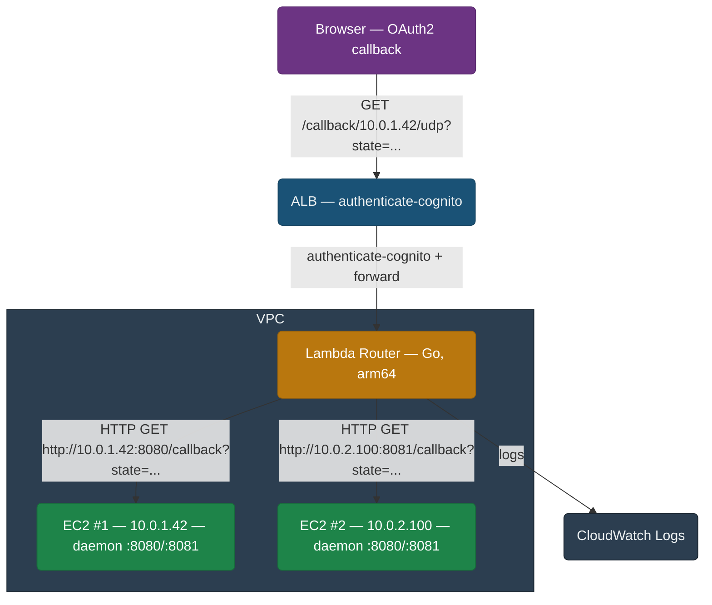
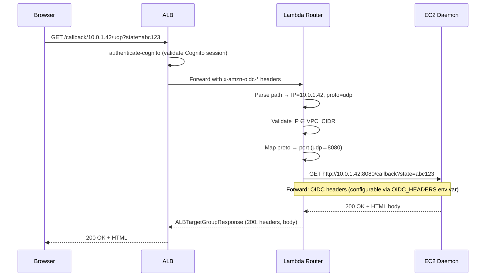
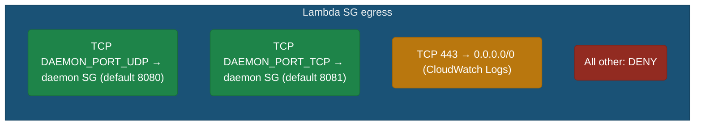

# Lambda Router Proxy

Lambda Router replaces the earlier callback-routing approach based on EventBridge, Python Lambda, and dynamic ALB rules with a simple native Go Lambda proxy. A single static ALB rule for `/callback/*` sends traffic to Lambda, which extracts the private IP from the URL path and proxies the HTTP request directly to the daemon on the correct EC2 instance.

## Architecture



## Request Flow



Processing steps in Lambda:

1. Parse path `/callback/<ip>/(udp|tcp)` — regex + `net.ParseIP()`
2. Validate the IP against `VPC_CIDR` — `vpcCIDR.Contains(ip)`
3. Map the protocol to a port — `udp→DAEMON_PORT_UDP`, `tcp→DAEMON_PORT_TCP`
4. Build the upstream URL — `http://<ip>:<port>/callback?state=<state>`
5. Issue an HTTP GET to the daemon with forwarded OIDC headers
6. Return the upstream response to ALB as-is

## Configuration

| Variable | Required | Default | Description |
|---|---|---|---|
| `VPC_CIDR` | yes | — | VPC CIDR used to validate target IPs (for example `10.0.0.0/16`) |
| `DAEMON_PORT_UDP` | no | `8080` | UDP daemon port |
| `DAEMON_PORT_TCP` | no | `8081` | TCP daemon port |
| `UPSTREAM_TIMEOUT` | no | `10s` | HTTP timeout for the upstream request (`time.ParseDuration` format) |
| `OIDC_HEADERS` | no | `["x-amzn-oidc-data","x-amzn-oidc-accesstoken","x-amzn-oidc-identity"]` | JSON array of OIDC header names to forward to the daemon |
| `LOG_LEVEL` | no | `info` | Log level: `debug`, `info`, `warn`, `error` |

These variables are set by the Terraform module and passed to the Lambda function. Invalid configuration causes a startup `panic` in Lambda as a fail-fast behavior.

## Logging

Lambda uses structured logging via `log/slog` with a JSON handler.

**Log levels:**

| Level | What is logged |
|--------|-----------------|
| `info` (default) | Cold start configuration, proxied requests (IP, proto, port, status, duration), errors |
| `debug` | Additionally: request path, presence or absence of OIDC headers (names only, never values) |

**Cold start log** is emitted once per Lambda startup and includes configured values such as the VPC CIDR, ports, timeout, and OIDC header list.

**Upstream duration** is logged for both successful and failed HTTP requests to the daemon.

**Log safety:**
- OIDC header values such as the JWT and access token are never logged
- The `state` parameter (signed session blob) is never logged; the upstream URL is redacted in error messages by removing it from `url.Error`

## Security

### Three Layers of Protection Against IP Tampering

After completing Cognito authentication, a user could try to tamper with the callback URL IP address, for example by changing `/callback/10.0.1.42/udp` to `/callback/10.0.2.100/udp`. Three independent layers prevent this from becoming a successful attack:

#### Layer 1: Security Groups

The Lambda security group allows egress only to the daemon security group on `DAEMON_PORT_UDP` and `DAEMON_PORT_TCP` (defaults: 8080/8081, configured by Terraform) and TCP 443 for CloudWatch Logs. Connections to hosts outside the daemon security group are blocked at the VPC level, regardless of the IP in the URL. This is the primary enforcement layer and still works even if the Lambda code has a bug.



#### Layer 2: VPC CIDR Validation

Lambda validates the path IP against `VPC_CIDR`. An IP outside the VPC returns 403 without attempting an upstream connection. The event is logged with `slog.Error` including the IP and CIDR.

```go
if !vpcCIDR.Contains(ip) {
    slog.Error("IP outside VPC CIDR", "ip", ip, "cidr", vpcCIDR)
    return errorPage(403, "Forbidden", "Invalid target"), nil
}
```

#### Layer 3: HMAC and Session Affinity

Even if the IP points to another VPN instance in the same VPC:

- **Without `--hmac-secret`** (default): each instance generates a random HMAC key at startup via `secrets.NewRandomSigner()`. The daemon on another instance has a different key, so `DecodeState()` returns `invalid state signature` and the request fails with 400 "Session Error". The request never reaches session lookup.

- **With `--hmac-secret`** (shared secret): HMAC validation succeeds, but the session identified by the SID in the state blob exists only in the original daemon instance's memory, so the result is `session not found` and 404 "Session Expired".

In the default cloud-config, `--hmac-secret` is not passed, so every instance generates its own random key. That is the strongest default protection.

### No Public Access

Lambda runs inside the VPC without a public IP. Communication with EC2 uses only private IP addresses. No secrets are embedded in code; configuration is passed through environment variables, and IAM roles are used instead of static credentials.

## Troubleshooting

### 400 Bad Request

**Cause:** The path URL does not match the `/callback/<ipv4>/(udp|tcp)` pattern.

Possible causes:
- Invalid IP format in the URL, for example a hostname instead of an IP, or IPv6
- Missing or invalid protocol segment, anything other than `udp` or `tcp`
- Extra path segments

**Diagnosis:** Check Lambda logs in CloudWatch (`/aws/lambda/<name>`). Check the URL generated by cloud-init in `/etc/openvpn-auth/env` on the EC2 instance.

**Fix:** Ensure cloud-config correctly reads `PRIVATE_IP` from `cloud-init query ds.meta_data.local_ipv4` and builds the URL as `https://<alb_domain>/callback/<ip>/<proto>`.

### 403 Forbidden

**Cause:** The IP in the path URL does not belong to `VPC_CIDR`.

Possible causes:
- Incorrect `VPC_CIDR` value in Terraform configuration
- The EC2 instance IP is outside the configured CIDR, for example in another subnet or VPC
- User tampering with the URL by replacing the IP

**Diagnosis:** Check Lambda logs. `slog.Error` logs the IP and CIDR for each rejection. Also check the `VPC_CIDR` value in the Lambda configuration in AWS Console under Configuration → Environment variables.

**Fix:** Correct `vpc_cidr` in `terraform.tfvars` and run `terraform apply`. Ensure the CIDR includes the subnets where the EC2 instances run.

### 503 Service Unavailable

**Cause:** Lambda cannot connect to the daemon on EC2 due to connection refused or timeout.

Possible causes:
- The daemon is not running on the EC2 instance due to a crash, restart, or initialization still in progress
- A security group is blocking traffic because the daemon security group is missing the required ingress rule
- The EC2 instance is unavailable because it is terminated, stopped, or unhealthy
- The upstream timeout `UPSTREAM_TIMEOUT` is too short

**Diagnosis:**
1. Check the daemon status on the instance: `systemctl status openvpn-auth-udp`
2. Check Lambda logs in CloudWatch. `slog.Error` with `"upstream unreachable"` includes the URL and error
3. Check security group rules. The daemon security group must allow TCP 8080/8081 ingress from the Lambda security group
4. Check the daemon `/healthz` endpoint

**Fix:** Restart the daemon or wait for the instance to be replaced by the ASG. If the issue is in the security group configuration, correct Terraform and run `terraform apply`.
