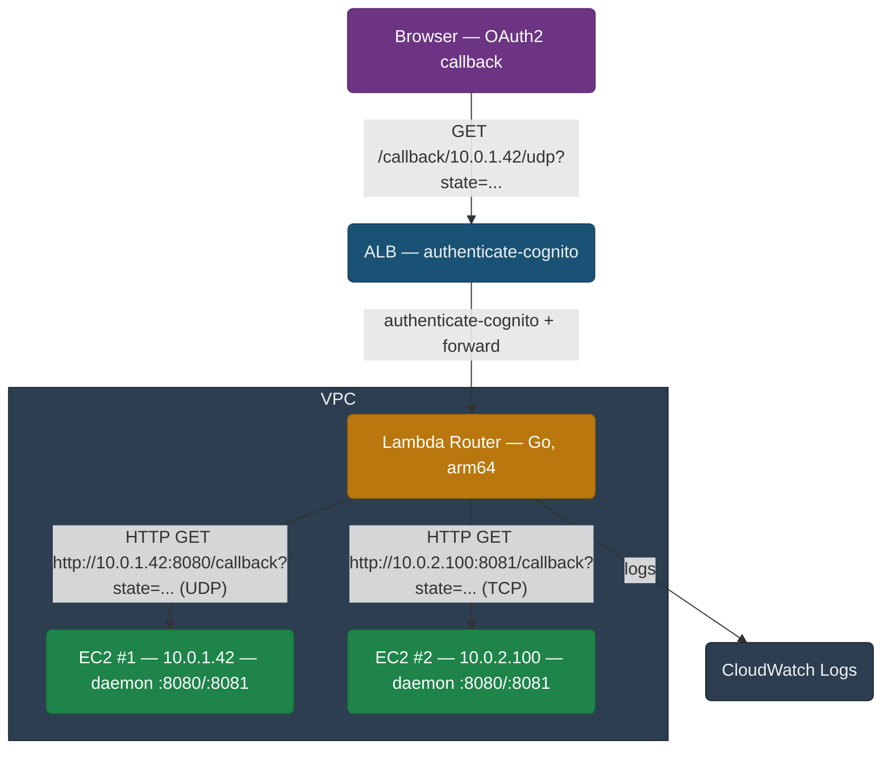
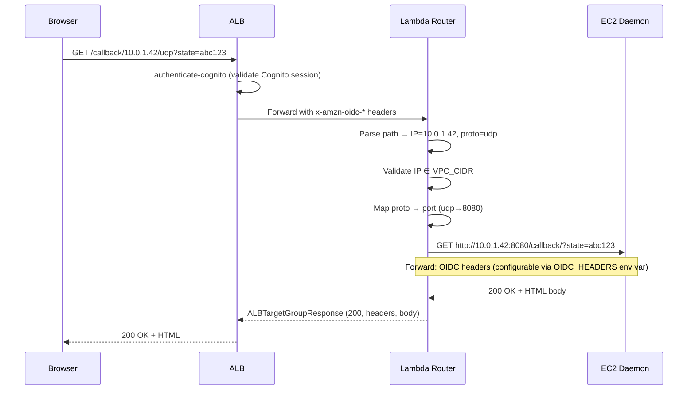
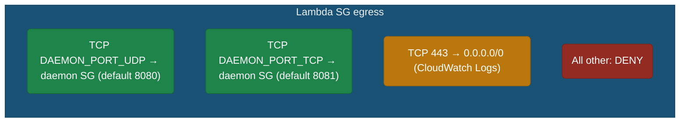

# Lambda Router Proxy

## Table of Contents

- [Architecture](#architecture)
- [Request Flow](#request-flow)
- [Configuration](#configuration)
- [Forwarded OIDC Headers](#forwarded-oidc-headers)
- [Logging](#logging)
- [Security](#security)
- [Troubleshooting](#troubleshooting)

> **Usage:** Lambda Router is used only in multi-instance mode (`multi_instance_mode = true`). In single-instance mode (`multi_instance_mode = false`), Terraform creates static ALB callback rules per listener and Lambda Router is not deployed.

Lambda Router replaces the earlier callback-routing approach based on EventBridge, Python Lambda, and dynamic ALB rules with a simple native Go Lambda proxy. A single static ALB rule for `/callback/*` sends traffic to Lambda, which extracts the private IP from the URL path and proxies the HTTP request directly to the daemon on the correct EC2 instance.

## Architecture


```mermaid
graph TD
    Browser("Browser — OAuth2 callback")
    ALB("ALB — authenticate-cognito")
    Lambda("Lambda Router — Go, arm64")
    EC2_1("EC2 #1 — 10.0.1.42 — daemon :8080/:8081")
    EC2_2("EC2 #2 — 10.0.2.100 — daemon :8080/:8081")
    CW("CloudWatch Logs")

    Browser -->|"GET /callback/10.0.1.42/udp?state=..."| ALB
    ALB -->|"authenticate-cognito + forward"| Lambda
    Lambda -->|"HTTP GET http://10.0.1.42:8080/callback?state=... (UDP)"| EC2_1
    Lambda -->|"HTTP GET http://10.0.2.100:8081/callback?state=... (TCP)"| EC2_2
    Lambda -->|"logs"| CW

    subgraph VPC
        Lambda
        EC2_1
        EC2_2
    end

    style Browser fill:#6c3483,stroke:#5b2c6f,color:#fff
    style ALB fill:#1a5276,stroke:#154360,color:#ecf0f1
    style Lambda fill:#b9770e,stroke:#9c640c,color:#fff
    style EC2_1 fill:#1e8449,stroke:#186a3b,color:#fff
    style EC2_2 fill:#1e8449,stroke:#186a3b,color:#fff
    style CW fill:#2c3e50,stroke:#1a252f,color:#ecf0f1
    style VPC fill:#2c3e50,stroke:#1a252f,color:#ecf0f1
```

## Request Flow


```mermaid
sequenceDiagram
    participant B as Browser
    participant ALB as ALB
    participant L as Lambda Router
    participant EC2 as EC2 Daemon

    B->>ALB: GET /callback/10.0.1.42/udp?state=abc123
    ALB->>ALB: authenticate-cognito (validate Cognito session)
    ALB->>L: Forward with x-amzn-oidc-* headers
    L->>L: Parse path → IP=10.0.1.42, proto=udp
    L->>L: Validate IP ∈ VPC_CIDR
    L->>L: Map proto → port (udp→8080)
    L->>EC2: GET http://10.0.1.42:8080/callback/?state=abc123
    Note over L,EC2: Forward: OIDC headers (configurable via OIDC_HEADERS env var)
    EC2-->>L: 200 OK + HTML body
    L-->>ALB: ALBTargetGroupResponse (200, headers, body)
    ALB-->>B: 200 OK + HTML
```

The diagram shows two independent callbacks to two different EC2 instances — one for a UDP session (routed to port `DAEMON_PORT_UDP`, default 8080) and one for a TCP session (routed to port `DAEMON_PORT_TCP`, default 8081). Each EC2 instance runs daemons on both ports; the port is chosen by the protocol segment in the path.

Processing steps in Lambda:

1. Parse path `/callback/<ip>/(udp|tcp)` — regex + `net.ParseIP()`
2. Validate the IP against `VPC_CIDR` — `vpcCIDR.Contains(ip)`
3. Map the protocol to a port — `udp→DAEMON_PORT_UDP`, `tcp→DAEMON_PORT_TCP`
4. Build the upstream URL — `http://<ip>:<port>/callback/?state=<state>` (trailing slash required — Go's `ServeMux` redirects `/callback` → `/callback/`)
5. Issue an HTTP GET to the daemon with forwarded OIDC headers
6. Return the upstream response to ALB as-is

## Configuration

| Variable | Required | Default | Description |
|---|---|---|---|
| `VPC_CIDR` | yes | — | VPC CIDR used to validate target IPs (for example `10.0.0.0/16`) |
| `DAEMON_PORT_UDP` | no | `8080` | UDP daemon port |
| `DAEMON_PORT_TCP` | no | `8081` | TCP daemon port |
| `UPSTREAM_CONNECT_TIMEOUT` | no | `3s` | TCP connection timeout to the target daemon; must be shorter than `UPSTREAM_TIMEOUT` (`time.ParseDuration` format) |
| `UPSTREAM_TIMEOUT` | no | `10s` | HTTP timeout for the upstream request (`time.ParseDuration` format) |
| `OIDC_HEADERS` | no | `["x-amzn-oidc-data"]` | JSON array of OIDC header names to forward to the daemon. Forwarding the unsigned legacy headers requires an explicit opt-in. |
| `LOG_LEVEL` | no | `info` | Log level: `debug`, `info`, `warn`, `error` |

These variables are set by the Terraform module and passed to the Lambda function. Invalid configuration causes a startup `panic` in Lambda as a fail-fast behavior.

## Forwarded OIDC Headers

ALB supplies three `x-amzn-oidc-*` headers to Lambda, but Lambda Router forwards
only `x-amzn-oidc-data` by default. The daemon's production authentication and
authorization path does not require the other two headers.

| Header | Content and verification | Sensitivity and use |
|---|---|---|
| `x-amzn-oidc-data` | UserInfo claims encoded as a JWT and signed by ALB with ES256. The daemon verifies the signature, expected ALB ARN in `signer`, and expiry before using its claims. | Contains identity and profile claims, so treat it as sensitive authentication data. The signature provides integrity and origin authentication, not confidentiality. Required by the daemon. |
| `x-amzn-oidc-accesstoken` | Access token returned by the IdP token endpoint. ALB forwards it in plaintext and does not sign it; AWS describes this legacy header as not independently verifiable by the application. | Highly sensitive bearer credential that may authorize access to server resources. The daemon does not use it for production decisions; decoding it is available only for explicit diagnostics. |
| `x-amzn-oidc-identity` | Plaintext copy of the `sub` value returned by the UserInfo endpoint. It is not signed by ALB and is not independently trustworthy. | A stable user identifier and therefore potentially sensitive personal data, although not a bearer credential. The daemon relies on verified claims from `x-amzn-oidc-data` instead of this header. |

See AWS's [User claims encoding and signature verification](https://docs.aws.amazon.com/elasticloadbalancing/latest/application/listener-authenticate-users.html#user-claims-encoding)
documentation for the authoritative header definitions and verification
requirements.

For short-lived diagnostics, the legacy headers can still be enabled explicitly
through Terraform:

```hcl
lambda_router_oidc_headers = [
  "x-amzn-oidc-data",
  "x-amzn-oidc-accesstoken",
  "x-amzn-oidc-identity",
]
```

For a Lambda deployed without this repository's Terraform, set `OIDC_HEADERS`
to the equivalent JSON array. The configuration accepts only the three headers
listed above, requires `x-amzn-oidc-data`, rejects duplicates, and fails fast on
invalid values.

This expands the credential-handling boundary and sends the access token over
the Lambda-to-daemon HTTP hop. Enable it only when required, keep
`--oidc-debug-claims` disabled in production, and restore the default after the
diagnostic session.

## Logging

Lambda uses structured logging via `log/slog` with a JSON handler.

**Log levels:**

| Level | What is logged |
|--------|-----------------|
| `info` (default) | Cold start configuration, proxied requests (IP, proto, port, status, duration), errors |
| `debug` | Additionally: request path, presence or absence of OIDC headers (names only, never values) |

**Cold start log** is emitted once per Lambda startup and includes configured values such as the VPC CIDR, ports, connection and overall timeouts, and OIDC header list.

**Upstream duration** is logged for both successful and failed HTTP requests to the daemon.

When the target daemon is unavailable, Lambda emits
`event=callback_upstream_unavailable` with `protocol`, a short `reference_id`,
and one stable `reason`: `connect_timeout`, `connection_refused`,
`request_timeout`, or `network_error`. The same reference ID is shown on the
user-facing `503` page. This expected ASG replacement/rollback path is logged
for diagnosis but does not emit a dedicated custom metric or alarm.

**Log safety:**
- OIDC header values such as the JWT and access token are never logged
- The `state` parameter (signed session blob) is never logged; the upstream URL is redacted in error messages by removing it from `url.Error`

## Security

### Three Layers of Protection Against IP Tampering

After completing Cognito authentication, a user could try to tamper with the callback URL IP address, for example by changing `/callback/10.0.1.42/udp` to `/callback/10.0.2.100/udp`. Three independent layers prevent this from becoming a successful attack:

#### Layer 1: Security Groups

The Lambda security group allows egress only to the daemon security group on `DAEMON_PORT_UDP` and `DAEMON_PORT_TCP` (defaults: 8080/8081, configured by Terraform) and TCP 443 for CloudWatch Logs. Connections to hosts outside the daemon security group are blocked at the VPC level, regardless of the IP in the URL. This is the primary enforcement layer and still works even if the Lambda code has a bug.


```mermaid
graph LR
    subgraph LSG["Lambda SG egress"]
        E1("TCP DAEMON_PORT_UDP → daemon SG (default 8080)")
        E2("TCP DAEMON_PORT_TCP → daemon SG (default 8081)")
        E3("TCP 443 → 0.0.0.0/0 (CloudWatch Logs)")
        E4("All other: DENY")
    end

    style LSG fill:#1a5276,stroke:#154360,color:#ecf0f1
    style E1 fill:#1e8449,stroke:#186a3b,color:#fff
    style E2 fill:#1e8449,stroke:#186a3b,color:#fff
    style E3 fill:#b9770e,stroke:#9c640c,color:#fff
    style E4 fill:#922b21,stroke:#7b241c,color:#fff
```

#### Layer 2: VPC CIDR Validation

Lambda validates the path IP against `VPC_CIDR`. An IP outside the VPC returns 403 without attempting an upstream connection. The event is logged with `slog.Error` including the IP and CIDR.

```go
if !vpcCIDR.Contains(ip) {
    slog.Error("IP outside VPC CIDR", "ip", ip, "cidr", vpcCIDR)
    return errorPage(403, "Forbidden", "Invalid target"), nil
}
```

#### Layer 3: HMAC and Session Affinity

Even if the IP points to another VPN instance in the same VPC:

- **Without `--hmac-secret`** (default): each instance generates a random HMAC key at startup via `secrets.NewRandomSigner()`. The daemon on another instance has a different key, so `DecodeState()` returns `invalid state signature` and the request fails with 400 "Session Error". The request never reaches session lookup.

- **With `--hmac-secret`** (shared secret): HMAC validation succeeds, but the session identified by the SID in the state blob exists only in the original daemon instance's memory, so the result is `session not found` and 404 "Session Expired".

In the default cloud-config, `--hmac-secret` is not passed, so every instance generates its own random key. That is the strongest default protection.

### No Public Access

Lambda runs inside the VPC without a public IP. Communication with EC2 uses only private IP addresses. No secrets are embedded in code; configuration is passed through environment variables, and IAM roles are used instead of static credentials.

## Troubleshooting

### 400 Bad Request

**Cause:** The path URL does not match the `/callback/<ipv4>/(udp|tcp)` pattern, or the `state` query parameter is missing.

Possible causes:
- Invalid IP format in the URL, for example a hostname instead of an IP, or IPv6
- Missing or invalid protocol segment, anything other than `udp` or `tcp`
- Extra path segments
- Missing `state` query parameter (Lambda rejects the request before proxying upstream)

**Diagnosis:** Check Lambda logs in CloudWatch (`/aws/lambda/<name>`). Check the URL generated by cloud-init in `/etc/openvpn-auth/env` on the EC2 instance.

**Fix:** Ensure cloud-config correctly reads `PRIVATE_IP` from `cloud-init query ds.meta_data.local_ipv4` and builds the URL as `https://<alb_domain>/callback/<ip>/<proto>`.

### 403 Forbidden

**Cause:** The IP in the path URL does not belong to `VPC_CIDR`.

Possible causes:
- Incorrect `VPC_CIDR` value in Terraform configuration
- The EC2 instance IP is outside the configured CIDR, for example in another subnet or VPC
- User tampering with the URL by replacing the IP

**Diagnosis:** Check Lambda logs. `slog.Error` logs the IP and CIDR for each rejection. Also check the `VPC_CIDR` value in the Lambda configuration in AWS Console under Configuration → Environment variables.

**Fix:** Correct `vpc_cidr` in `terraform.tfvars` and run `terraform apply`. Ensure the CIDR includes the subnets where the EC2 instances run.

### 503 Service Unavailable

**Cause:** Lambda cannot connect to the daemon on EC2 due to connection refused or timeout.

Possible causes:
- The daemon is not running on the EC2 instance due to a crash, restart, or initialization still in progress
- A security group is blocking traffic because the daemon security group is missing the required ingress rule
- The EC2 instance is unavailable because it is terminated, stopped, or unhealthy
- The browser returned to a stale callback during an ASG rolling replacement or rollback
- The TCP connection timeout `UPSTREAM_CONNECT_TIMEOUT` is too short
- The upstream timeout `UPSTREAM_TIMEOUT` is too short

**Diagnosis:**
1. Check the daemon status on the instance: `systemctl status openvpn-auth-udp`
2. Match the page's reference ID to the structured
   `event=callback_upstream_unavailable` Lambda log and inspect its stable
   `reason`. The signed state and upstream URL are not logged.
3. Check security group rules. The daemon security group must allow TCP 8080/8081 ingress from the Lambda security group
4. Check the daemon `/healthz` endpoint

**User recovery:** Do not refresh the old callback page. Disconnect the VPN
client, connect again through the NLB, and complete authentication using the new
link.

**Operator fix:** A stale callback during ASG replacement requires no repair.
For persistent failures, restart the daemon or wait for ASG recovery. If the
issue is in the security group or timeout configuration, correct Terraform and
run `terraform apply`.
