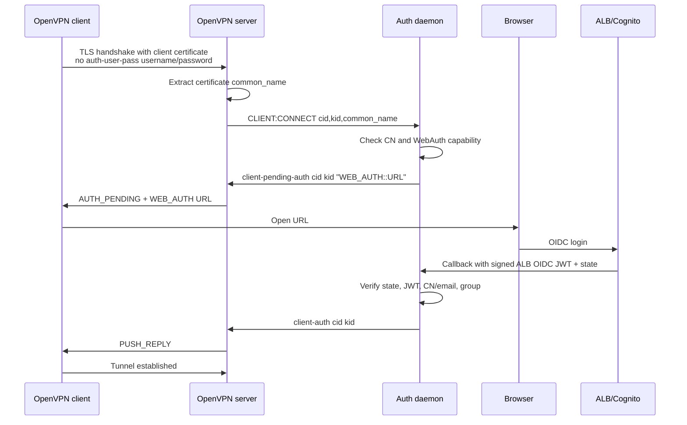

# OpenVPN Server Configuration

## Tested Version

This project targets **OpenVPN CE 2.7.4** (installed from the [official OpenVPN 2.7 repository](https://build.openvpn.net/debian/openvpn/release/2.7/)). The version is pinned and configurable:

| Environment | How to change | Default |
|-------------|---------------|---------|
| Docker lab | `OPENVPN_VERSION` build arg in `lab/Dockerfile.openvpn` | `2.7.4` |
| Terraform | `openvpn_version` variable in `terraform/variables.tf` | `"2.7.4"` |

**Minimum required:** OpenVPN 2.7.4 for the first release target. OpenVPN 2.6+ has the `IV_SSO webauth` mechanism used for browser-based authentication, but this project is migrating to 2.7.4 before release so multi-socket behavior can be tested against the supported target.

## OpenVPN 2.7 Multi-Socket Example

OpenVPN 2.7 can run one server process with multiple listening sockets. The verified Docker lab uses one UDP listener, one TCP listener, and one management Unix socket:

```text
local 0.0.0.0 1194 udp
local 0.0.0.0 1195 tcp-server
dev tun

tls-server
server 10.8.0.0 255.255.255.0
topology subnet

keepalive 10 120
persist-tun
cipher AES-256-GCM
data-ciphers AES-256-GCM:AES-128-GCM:CHACHA20-POLY1305
tls-version-min 1.2
verb 3
reneg-sec 3600

management /run/openvpn/management.sock unix /etc/openvpn/management-pw
management-client-auth
management-hold
auth-user-pass-optional
hand-window 300

dh none
tls-crypt /etc/openvpn/server/tls-crypt.key
```

Lab commands:

```bash
VPN_AUTH_MANAGEMENT_RAW_LOG=true RENEG_SEC=30 make stack-rebuild-multisocket
REAUTH_WAIT=35 make verify-multisocket
make stack-down-multisocket
```

Current verified behavior:

- UDP and TCP clients both reach `AUTH_PENDING`, complete browser callback, and establish tunnels through one OpenVPN process.
- Both listener types emit `CLIENT:CONNECT`, `CLIENT:ESTABLISHED`, `CLIENT:REAUTH`, and `CLIENT:DISCONNECT` through the same management socket.
- `client-auth <cid> <kid>` works for UDP and TCP clients in the same OpenVPN process.
- `status 3` after daemon reconnect can rebuild established sessions from `CLIENT_LIST`.

Important limitation: OpenVPN 2.7.4 management events do not expose the exact local listener that accepted the client. `CLIENT:*` env includes the configured listener list, and `status 3` includes coarse protocol hints such as `udp4` or `tcp4-server`, but not the local bind address/port that accepted the client. Treat listener/protocol data as diagnostics only. Daemon routing and auth decisions use signed state plus `cid/kid`.

The Terraform deployment may still use separate OpenVPN processes while the supervisor/runtime migration is in progress. See [OpenVPN 2.7 Migration Notes](openvpn-2.7-migration.md) for the full plan and raw lab findings.

## Required Directives

The server config must include these directives for the auth daemon to work:

```text
management /run/openvpn/management.sock unix /path/to/management-pw
management-client-auth
management-hold
auth-user-pass-optional
hand-window 300
tls-crypt /etc/openvpn/server/tls-crypt.key
cipher AES-256-GCM
data-ciphers AES-256-GCM:AES-128-GCM:CHACHA20-POLY1305
tls-version-min 1.2
```

| Directive | Purpose |
|-----------|---------|
| `management` | Enables the management interface on a Unix socket with password auth |
| `management-client-auth` | Delegates client authentication to the management interface (daemon) |
| `management-hold` | Holds OpenVPN startup until daemon sends `hold release` |
| `auth-user-pass-optional` | Allows connection without username/password — identity comes from TLS certificate CN |
| `hand-window` | Time (seconds) allowed for the full TLS handshake including browser-based auth. Must match `--hand-window` on the daemon. Default is 60s which is too short for browser auth — set to 300s or more |
| `tls-crypt` | Encrypts and authenticates the TLS control channel using a shared static key. This project uses plain `tls-crypt`, not `tls-auth`, for the first release target. |
| `cipher` / `data-ciphers` | Pins AEAD data-channel negotiation and avoids legacy fallback behavior. |
| `tls-version-min` | Sets the minimum TLS version explicitly. First release target is TLS 1.2 or newer. |

### `auth-user-pass-optional` Flow

`auth-user-pass-optional` lets a client start the OpenVPN connection without an `auth-user-pass` directive and without entering a static VPN username/password. This project relies on that behavior: the client profile carries a TLS client certificate, and browser-based OIDC authorizes the human user.

For the detailed management-message and callback protocol, see [OpenVPN WebAuth Protocol](webauth-protocol.md).

The resulting flow is:



Security consequence: `auth-user-pass-optional` removes the static VPN password prompt, but it does not make the VPN anonymous or unauthenticated. A successful tunnel still requires a valid client certificate, WebAuth-capable client metadata, a valid signed callback state, a successful ALB/Cognito login, and any configured CN/group authorization checks.

## Unsupported Directives

Do **not** set `duplicate-cn`.

OpenVPN's default behavior is to allow only one active client instance per certificate common name within a single server process. The `duplicate-cn` directive disables that protection and allows multiple concurrent sessions using the same certificate/CN.

This project assumes `duplicate-cn` is absent:

- Single EC2 / single OpenVPN process: OpenVPN itself handles duplicate CN replacement.
- UDP + TCP on one EC2: each OpenVPN process enforces duplicate CN only for itself; there is no built-in cross-protocol guarantee.
- Multi-instance deployments: duplicate-CN prevention requires a global ownership mechanism, not `duplicate-cn`.

The daemon's local CN tracking is only defensive cleanup for stale local state. It must not be treated as a replacement for OpenVPN's default duplicate-CN behavior or for future global single-session enforcement.

## Recommended Settings

### Systemd Unit

Terraform generates `openvpn-auth-udp.service` and `openvpn-auth-tcp.service` from the cloud-config template. For non-Terraform installs, see [docs/examples/openvpn-auth.service](examples/openvpn-auth.service) for a standalone systemd unit with daemon-specific hardening settings.

### Verbosity

Set `verb 3` (or higher) to see client connect/disconnect events in OpenVPN logs:

```text
verb 3
```

With `verb 2`, disconnect events are **not logged** by OpenVPN, though the daemon still receives them via the management interface. This can make debugging difficult.

### Keepalive and Disconnect Detection

```text
keepalive 10 120
```

This sets `ping 10` and `ping-restart 120`:
- Server pings client every 10 seconds
- Server considers client dead after 120 seconds of silence

With UDP, there is no connection teardown like TCP. Client disconnects are detected in two ways:

1. **Clean shutdown** — client sends an explicit exit notification (`cc-exit` protocol flag). Disconnect is immediate.
2. **Force kill** (e.g. double Ctrl+C, network drop, crash) — client disappears without notification. Server waits for `ping-restart` timeout (120s with the above config) before sending `>CLIENT:DISCONNECT` to the daemon.

The daemon logs disconnect events as they arrive:
```
time=2026-03-13T12:05:00Z level=INFO msg=disconnect cid=3
```

If you don't see a disconnect log after a client disappears, wait for the `ping-restart` timeout.

### Renegotiation and Reauth

```text
reneg-sec 3600
```

Controls how often OpenVPN renegotiates the TLS session. Each renegotiation triggers `>CLIENT:REAUTH` on the management interface. The daemon handles this by checking the user's identity in Cognito — **no browser interaction required**.

The reauth flow:

1. OpenVPN triggers TLS renegotiation after `reneg-sec` seconds
2. Sends `>CLIENT:REAUTH,CID,KID` to management interface
3. Daemon calls Cognito `AdminGetUser` to verify user still exists, is enabled, and (optionally) is in the required group
4. Sends `client-auth-nt` (continue tunnel) or `client-deny` (disconnect user)

This means:
- **User disabled in Cognito** — disconnected at next renegotiation (within `reneg-sec`)
- **User removed from required group** — disconnected if `--check-groups-on-reauth=true`
- **Cognito unavailable** — denied by default, or allowed from cache if `--reauth-cache=true`

Daemon logs for reauth:

```
time=...Z level=INFO msg=reauth cid=0 cn=john@example.com
time=...Z level=INFO msg="reauth allowed" cid=0 cn=john@example.com
```

The lab setup uses `reneg-sec 600` (10 minutes) for faster testing. For production, `reneg-sec 3600` (1 hour) is typical.

The daemon's `--reneg-interval` should match this value (used for reauth cache TTL calculation).

### Interaction with `--max-session-duration`

When `--max-session-duration` is set, the daemon enforces a hard time limit on established sessions via two mechanisms:

1. **Hard timer** — after `client-auth` succeeds, the daemon starts a timer that sends `client-kill` after the configured duration, regardless of `reneg-sec`.
2. **Reauth backstop** — on each `CLIENT:REAUTH`, the daemon checks whether the session has exceeded `max-session-duration` and sends `client-deny` with reason `"session expired"` if so.

If `reneg-sec=0` (renegotiation disabled), no `CLIENT:REAUTH` events are sent, so the hard timer is the **only** enforcement mechanism. When `reneg-sec > 0`, both mechanisms are active — whichever fires first terminates the session.

On management reconnect (daemon restart, socket drop, or OpenVPN restart), the daemon queries `status 3` and rebuilds expiry tracking from the live OpenVPN state. If a session has already exceeded its limit, it is killed immediately. If OpenVPN restarted (empty `status 3`), all timers are cleaned up and clients must reconnect. See [Architecture — Management Socket Reconnect](architecture.md#management-socket-reconnect-and-session-tracking) for the full scenario matrix.

## NAT Masquerade (nftables)

The EC2 instance is configured at boot (via cloud-init) to NAT VPN client traffic using nftables. This allows VPN clients to reach resources in the VPC or the internet through the server's primary network interface.

**What cloud-init does:**

1. Enables IP forwarding via sysctl (`net.ipv4.ip_forward = 1`).
2. Creates an nftables NAT table with a `postrouting` masquerade rule for both the UDP and TCP VPN client CIDRs:
   ```
   table ip nat {
     chain postrouting {
       type nat hook postrouting priority 100;
       ip saddr <udp_client_cidr> oifname <primary_iface> masquerade
       ip saddr <tcp_client_cidr> oifname <primary_iface> masquerade
     }
   }
   ```
3. Saves the ruleset to `/etc/nftables.conf` and enables the `nftables` systemd service so rules are restored on reboot.

The primary interface is detected dynamically at boot from the default route (`ip route show default`), so the config works regardless of whether the NIC is named `eth0`, `ens5`, etc.

> **Note:** nftables is used in preference to iptables. Ubuntu 24.04 (Noble) ships with nftables as the native firewall framework; iptables on that platform is a compatibility shim over the nftables backend anyway.

## Pushed Routes

> **Note:** Only split-tunnel mode is supported by the current Terraform code. Full-tunnel (`push "redirect-gateway def1"`) is not wired up — to redirect all client traffic through the VPN you would need to extend the cloud-config template manually.

VPN clients receive no routes by default (split-tunnel). To push routes, set the `pushed_routes` Terraform variable — a list of CIDRs that are injected as `push "route ..."` directives into both the UDP and TCP OpenVPN server configs at plan time.

```hcl
pushed_routes = ["10.0.0.0/16", "10.1.0.0/24"]
```

This generates, for each listener:

```text
push "route 10.0.0.0 255.255.0.0"
push "route 10.1.0.0 255.255.255.0"
```

> **Note:** Pushing routes does not automatically open EC2 security group rules for that traffic — the two are configured independently (see below).

## EC2 Security Group Rules for Forwarded Traffic

The EC2 instance has a catch-all egress rule (`0.0.0.0/0`) for internet-bound traffic (AWS API calls, apt, etc.). For forwarded VPN client traffic, use the `ec2_sg_rules` variable to add **explicit, protocol-scoped** ingress and/or egress rules. This is intentionally separate from `pushed_routes` — you can push a broad route to clients while restricting what the EC2 instance is actually permitted to forward.

```hcl
ec2_sg_rules = {
  ingress = [
    {
      description = "ICMP from VPC"
      cidr_ipv4   = "10.0.0.0/16"
      ip_protocol = "icmp"
      from_port   = -1
      to_port     = -1
    },
  ]
  egress = [
    {
      description = "HTTPS to VPC"
      cidr_ipv4   = "10.0.0.0/16"
      ip_protocol = "tcp"
      from_port   = 443
      to_port     = 443
    },
    {
      description = "SSH to VPC"
      cidr_ipv4   = "10.0.0.0/16"
      ip_protocol = "tcp"
      from_port   = 22
      to_port     = 22
    },
    {
      description = "ICMP to VPC"
      cidr_ipv4   = "10.0.0.0/16"
      ip_protocol = "icmp"
      from_port   = -1
      to_port     = -1
    },
  ]
}
```

`ingress` is optional and defaults to `[]`. `egress` defaults to a single catch-all rule (`0.0.0.0/0`, all protocols) required for internet-bound traffic (AWS API calls, apt, etc.) — override it if you want stricter outbound control.

To allow all protocols to a CIDR (e.g. a fully-trusted private network), set `ip_protocol = "-1"` and omit `from_port`/`to_port`:

```hcl
ec2_sg_rules = {
  egress = [
    {
      description = "All outbound"
      cidr_ipv4   = "0.0.0.0/0"
      ip_protocol = "-1"
    },
    {
      description = "All traffic to trusted private subnet"
      cidr_ipv4   = "10.0.0.0/16"
      ip_protocol = "-1"
    },
  ]
}
```

## Client Config

Minimal client config for WebAuth:

```text
client
dev tun
proto udp
remote <server-ip> 1194
resolv-retry infinite
nobind
persist-tun
remote-cert-tls server
verify-x509-name server name
verb 3
push-peer-info
setenv IV_SSO webauth
cipher AES-256-GCM
data-ciphers AES-256-GCM:AES-128-GCM:CHACHA20-POLY1305
tls-version-min 1.2

<ca>
... CA certificate ...
</ca>

<cert>
... client certificate (CN = user email) ...
</cert>

<key>
... client private key ...
</key>

<tls-crypt>
... shared tls-crypt key ...
</tls-crypt>
```

Notes:
- **No `auth-user-pass`** — authentication happens via browser (OIDC), not username/password
- **`verify-x509-name server name`** — generated profiles pin the expected server certificate CN (`server`) in addition to `remote-cert-tls server`
- **Certificate CN** should match the user's email in Cognito (used for CN cross-check when `--cn-cross-check=true`)
- **OpenVPN 2.x CLI** is recommended to include `push-peer-info` and `setenv IV_SSO webauth` so the client sends WebAuth support metadata to the server consistently in the tested CLI flow
- **Do not set `IV_SSO` in the server config.** `IV_SSO` is client capability metadata. Setting it on the server can make the daemon send `WEB_AUTH` to clients that did not actually advertise browser-auth support.
- **OpenVPN 2.x CLI URL clicks:** the CLI logs WebAuth as `('URL')`; some terminals include the closing apostrophe when linkifying the URL. The daemon tolerates a trailing artifact in the `state` parameter in two forms: `'` (direct hit) and the literal `%27` (after Lambda Router query re-encoding in multi-instance mode).
- Client must support WebAuth (OpenVPN 2.6+ with `IV_SSO` or `IV_PROTO` flags)
- **`push-peer-info`** causes the client to send additional environment variables to the server on connect. The daemon logs the following fields on every `connect` event:

  | Log field | Source variable | Always sent | Requires `push-peer-info` |
  |-----------|----------------|:-----------:|:-------------------------:|
  | `ip` | `untrusted_ip` | ✅ | — |
  | `port` | `untrusted_port` | ✅ | — |
  | `plat` | `IV_PLAT` | ✅ | — |
  | `ver` | `IV_VER` | ✅ | — |
  | `gui_ver` | `IV_GUI_VER` / `IV_UI_VER` | ✅¹ | — |
  | `hwaddr` | `IV_HWADDR` | — | ✅ |
  | `plat_ver` | `IV_PLAT_VER` | — | ✅ |
  | `ssl` | `IV_SSL` | — | ✅ |

  ¹ `IV_GUI_VER` is set by the client UI via `--setenv`; always present in OpenVPN GUI and OpenVPN3/Linux.

  **OpenVPN3/Linux limitations:** OpenVPN3 core library (used by `openvpn3-linux` and OpenVPN Connect) does **not** send `IV_HWADDR`, `IV_PLAT_VER`, or `IV_SSL` — even with `push-peer-info` enabled. These fields will always be empty for OpenVPN3 clients. This is a known limitation of the OpenVPN3 core library, not a configuration issue. Full peer info is only available from OpenVPN 2.x clients (e.g. OpenVPN GUI on Windows, Tunnelblick on macOS).

  Example log — **OpenVPN 2.7.1 / Windows GUI** (full peer info):
  ```
  msg=connect cid=0 kid=1 cn=user@example.com ip=203.0.113.42 port=57050 hwaddr=ac:74:b1:49:9b:75 plat=win plat_ver=10.0.26200,amd64 ver=2.7.1 gui_ver=OpenVPN_GUI_11.62.0.0 ssl=OpenSSL_3.6.1_27_Jan_2026
  ```

  Example log — **OpenVPN3 3.11.6 / Linux** (limited peer info):
  ```
  msg=connect cid=2 kid=1 cn=user@example.com ip=203.0.113.42 port=55288 hwaddr="" plat=linux plat_ver="" ver=3.11.6 gui_ver=OpenVPN3/Linux/v27 ssl=""
  ```

### Why We Do Not Use `auth-user-pass username-only`

OpenVPN 2.7.1 added a `username-only` flag for the client-side `--auth-user-pass` option:

```text
auth-user-pass username-only
```

With this flag, the client asks only for a username and sends a dummy password to the server. It was added for deployments where the server uses an external challenge based on username and does not perform password authentication. The upstream discussion is [OpenVPN/openvpn#501](https://github.com/OpenVPN/openvpn/issues/501), and the feature is listed in the [OpenVPN 2.7.1 release notes](https://github.com/OpenVPN/openvpn/releases/tag/v2.7.1).

That problem is different from this project's model.

The `username-only` flag is useful for SSO-only or certificate-less OpenVPN designs where the client would otherwise fail local config validation because no client-side authentication method is configured. In that model, `auth-user-pass` is mostly a client compatibility shim: it satisfies OpenVPN's requirement for a client-side auth method and gives the server an initial username for the external WebAuth/OIDC challenge.

This project intentionally does not use that flow:

- The client profile already contains a TLS client certificate and private key, so OpenVPN has a real client-side authentication method before WebAuth starts.
- The server uses `auth-user-pass-optional` so a static VPN username/password is not required.
- The initial identity signal is the certificate `common_name`, not a user-entered OpenVPN username.
- The browser OIDC callback authorizes the human user, and `--cn-cross-check=true` binds the OIDC `email` claim back to the certificate CN.
- Adding `auth-user-pass username-only` would introduce a second user-supplied identity field that must be reconciled with certificate CN and OIDC claims, without improving the current security model.

Use `auth-user-pass username-only` only if the project later adds an explicit alternate mode where OpenVPN usernames are part of the trust model. For the current release target, client profiles should continue to omit `auth-user-pass`.

## Client Compatibility

| Client | Platform | Min version | Status | Notes |
|--------|----------|-------------|--------|-------|
| OpenVPN3 Linux CLI (`openvpn3-linux`) | Linux | 3.9+ | Supported | Opens the browser for OIDC in the tested flow. |
| OpenVPN 2.x CLI | Linux/BSD | 2.6.0+ | Supported with caveat | Requires `push-peer-info` and `setenv IV_SSO webauth`; some Linux environments may require manually opening the logged `WEB_AUTH::` URL. |
| OpenVPN GUI (Community) on Windows | Windows | 2.6.0+ | Supported | Sends GUI/WebAuth peer metadata in tested client logs. |
| Tunnelblick on macOS | macOS | 4.0.0beta10+ | Expected compatible | Tunnelblick 4 documents support for `WEB_AUTH`; not part of this repo's automated lab. |
| Viscosity | Windows/macOS | — | Expected compatible | Per upstream `openvpn-auth-oauth2` wiki: WebAuth works; Viscosity rejects non-HTTPS endpoints by default. Not tested in this repo's lab. |
| openvpn3-indicator | Linux (GUI for `openvpn3-linux`) | — | Expected compatible | Reported working by upstream `openvpn-auth-oauth2` wiki. Inherits OpenVPN3 core peer-info limitations (see above). Not tested in this repo's lab. |
| OpenVPN Connect v3 | Windows/macOS/Linux | — | Partial (per upstream) | Upstream `openvpn-auth-oauth2` wiki reports connection issues with a documented workaround. Inherits OpenVPN3 core peer-info limitations. Not tested in this repo's lab. |
| Ubuntu/Mint NetworkManager `network-manager-openvpn` (and `-gnome`) | Linux | — | Unsupported | The standard plugin may import `push-peer-info`, but does not pass `IV_SSO=webauth` or handle the `WEB_AUTH` URL in the observed Ubuntu/Mint flow. The daemon rejects it with `client does not support WebAuth`. Upstream `openvpn-auth-oauth2` wiki also lists `network-manager-openvpn-gnome` as non-working. |
| `nm-openvpn-sso` third-party plugin | Linux | — | Experimental | Designed for NetworkManager + OpenVPN SSO/OAuth. Not bundled, audited, or tested by this project. |

**Status legend:**
- **Supported** — exercised in this repo's tested flow (lab or maintainer's environment).
- **Expected compatible** — implements the relevant `IV_SSO=webauth` / `WEB_AUTH::` handling per its own docs or a credible upstream report, but is not part of this repo's automated lab.
- **Partial** — known to connect with caveats or workarounds; verify against the cited source before relying on it.
- **Unsupported** — observed to fail the daemon's WebAuth gate in tested environments.
- **Experimental** — third-party / unaudited; use only for evaluation.

> Several rows above are sourced from the upstream `jkroepke/openvpn-auth-oauth2` wiki (a different project that targets the same OpenVPN WebAuth surface). They share the OpenVPN-side requirements (`IV_SSO=webauth`, `WEB_AUTH::` URL handling), so client-level compatibility tends to carry over, but server-side behavior, claims, and CN cross-check are specific to this project. Treat upstream-sourced rows as a starting point, not a guarantee.

## OpenVPN3 Linux CLI

OpenVPN3 Linux (`openvpn3-linux`) works with this project out of the box. Run without `sudo` — OpenVPN3 uses D-Bus and separates privileges internally.

References:
- OpenVPN 3 Linux Client: https://openvpn.net/community-docs/openvpn-client-for-linux.html
- Community OpenVPN 3 Linux Wiki: https://community.openvpn.net/Pages/OpenVPN3Linux

```bash
# Connect
openvpn3 session-start --config client.ovpn

# List active sessions
openvpn3 sessions-list

# View logs (attach to running session)
openvpn3 log --config client.ovpn

# View logs with debug verbosity
openvpn3 log --config client.ovpn --log-level 6

# Disconnect
openvpn3 session-manage --config client.ovpn --disconnect
```

> **Note:** After `session-start`, the browser opens for OIDC authentication and may print a message (e.g. `Opening in existing browser session.`) to the terminal. The shell prompt is already available — press Enter if it appears stuck.

## OpenVPN3 Linux GUI: openvpn3-indicator

For Linux desktop users who prefer a tray indicator instead of the CLI, [openvpn3-indicator](https://github.com/OpenVPN/openvpn3-indicator) is the recommended GUI. It is a GTK system-tray application that talks to the same `openvpn3-linux` D-Bus service, lists configured profiles, shows connection state, opens the browser for `WEB_AUTH::`, and surfaces session notifications. Importing an `.ovpn` file produced by this project's `pki.sh` works the same as for the CLI flow.

Why we recommend it (and why we are not shipping our own):

- **Project provenance.** Hosted under the [`github.com/OpenVPN`](https://github.com/OpenVPN) organization, not an unaffiliated hobbyist fork. Licensed AGPL-3.0. Repo is active and not archived (last commit 2026-01-07 at the time of writing).
- **Security boundary.** openvpn3-indicator is a UI shell, not a security boundary. It does not handle private keys, does not decrypt traffic, does not talk to the network — it calls D-Bus methods on `openvpn3-linux` (the privileged C++ daemon), renders status, and opens the browser for `WEB_AUTH::`. The realistic CVE surface for the indicator itself is small. The security-critical code paths live in `openvpn3-linux` and the OpenVPN3 core library, both of which you depend on regardless of what GUI sits on top — and both of which receive patches through OpenVPN Inc and your distribution's package channel.
- **Maintenance reality (transparent).** The indicator has a small contributor list with one primary maintainer; commit cadence is burst-driven (active sprints separated by quiet periods) rather than continuous. There are no published GitHub Security Advisories for the project at the time of writing. We treat it as supportable but worth pinning rather than tracking `main` blindly. See "Operational guidance" below.

Quick start (Debian/Ubuntu — adjust for other distributions):

```bash
# openvpn3-linux must be installed first; follow the upstream guide:
#   https://openvpn.net/community-docs/openvpn-client-for-linux.html

# Then install the indicator (package name and availability vary by distro;
# see the openvpn3-indicator README for distro-specific instructions and PPAs).
sudo apt install openvpn3-indicator   # if available in your distro's repo

# Import the profile generated by pki.sh
openvpn3 config-import --config client.ovpn --persistent

# Launch the indicator (it auto-starts on login once configured)
openvpn3-indicator
```

The indicator will then list the imported profile, let you connect from the tray menu, and open the browser when the daemon emits `WEB_AUTH::URL`.

Operational guidance:

- **Pin a version** rather than tracking `main`. Treat upstream releases like any other dependency: read the changelog, test, then upgrade.
- **Watch releases and security advisories** on the upstream repo (GitHub "Watch" → "Custom" → Releases + Security advisories).
- **Re-evaluate** if upstream goes silent for an extended period (e.g. ≥ 9 months without a commit) *and* an open issue tagged for security appears, or if a new `openvpn3-linux` D-Bus API change breaks the indicator. Until one of those triggers fires, the cost of forking or rewriting is hard to justify.
- **Peer-info limitation still applies.** Like every OpenVPN3 core client, `openvpn3-indicator` does not send `IV_HWADDR`, `IV_PLAT_VER`, or `IV_SSL` even with `push-peer-info` enabled (see the peer-info table earlier in this document).

## Management Interface Protocol

The daemon communicates with OpenVPN via the management interface using these commands:

| Command | When | Purpose |
|---------|------|---------|
| `hold release` | On connect / `>HOLD:` | Release OpenVPN from management hold |
| `client-pending-auth CID KID "WEB_AUTH::URL" TIMEOUT` | `>CLIENT:CONNECT` | Send WebAuth URL to client |
| `client-auth CID KID` + `END` | Callback success | Allow client connection |
| `client-auth-nt CID KID` | `>CLIENT:REAUTH` success | Allow renegotiation (no tunnel changes) |
| `client-deny CID KID "reason"` | Auth failure | Deny client with reason |
| `client-kill CID [HALT]` | Session eviction | Kill established connection; `HALT` stops the client without auto-reconnect |
