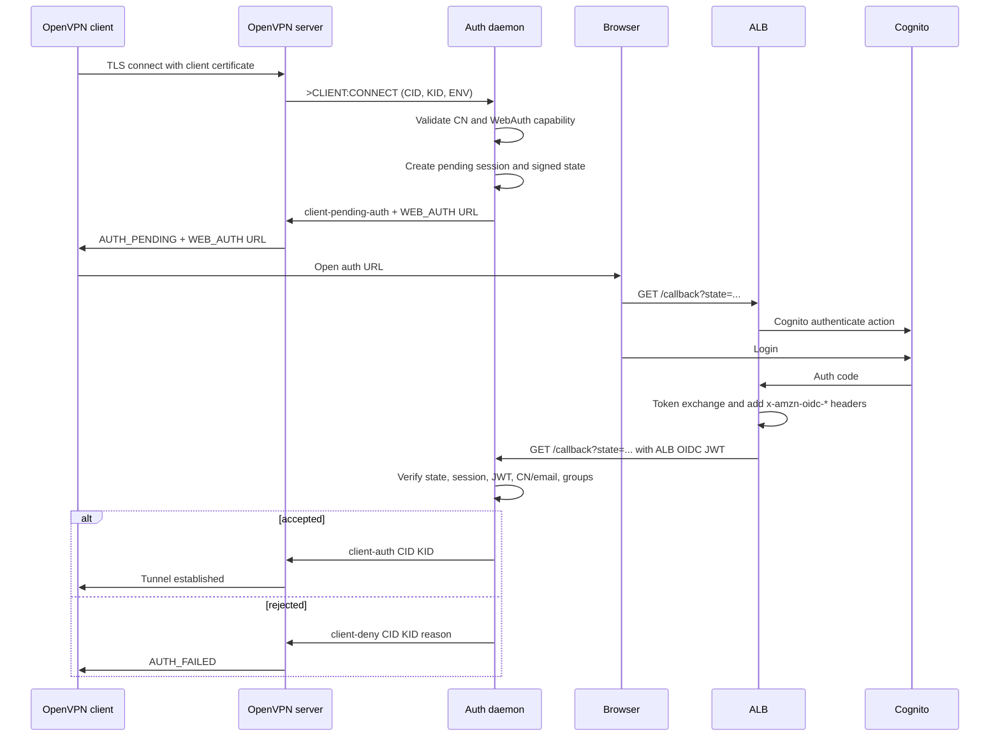

# Overview

`openvpn-auth-aws` authenticates OpenVPN clients with browser-based OIDC through AWS Cognito. OpenVPN verifies the client certificate first, then pauses the connection in `AUTH_PENDING` while the daemon sends the user through the ALB/Cognito login flow.

## End-To-End Flow



## Runtime Shape

The current deployment runs separate OpenVPN and daemon processes for UDP and TCP. Each daemon owns one OpenVPN management socket, one callback port, and one in-memory session store.

```text
EC2 instance
  ├─ openvpn-server@udp  -> management socket -> openvpn-auth-udp  :8080
  └─ openvpn-server@tcp  -> management socket -> openvpn-auth-tcp  :8081
```

OpenVPN 2.7 multi-socket support is verified in the lab and is the target migration path, but the first compatibility step keeps the current one-management-socket runtime model.

## Deployment Modes

- **Single-instance mode** is the default. OpenVPN client traffic uses an Elastic IP attached only after daemon health checks pass. Browser callbacks are routed by static ALB paths.
- **Multi-instance mode** sends OpenVPN client traffic through an NLB and browser callbacks through the Lambda Router, which proxies callback requests to the correct EC2 daemon by private IP.

## Read Next

- [Architecture](architecture.md) - auth flow, callback verification, deployment modes, health, and session lifecycle.
- [OpenVPN WebAuth Protocol](webauth-protocol.md) - exact OpenVPN management messages and WebAuth behavior.
- [OpenVPN Server](openvpn-server.md) - required OpenVPN directives, client profile behavior, and reauth.
- [Configuration](configuration.md) - daemon flags, environment variables, logging, and metrics.
- [Group Authorization and OIDC Claims](group-authorization.md) - group checks, claim parsing, OIDC debug logging, and ALB/Cognito scope behavior.
- [Direct Entra OIDC](direct-entra-oidc.md) - possible future ALB `authenticate-oidc` mode without Cognito federation.
- [PKI](pki.md) - certificate and `tls-crypt` key management.
- [OpenVPN 2.7 Migration Notes](openvpn-2.7-migration.md) - multi-socket lab results and supervisor/runtime migration plan.
- [Testing](testing.md) - local, Docker, and AWS validation flows.
- [Troubleshooting](troubleshooting.md) - known failure modes and useful diagnostic commands.
