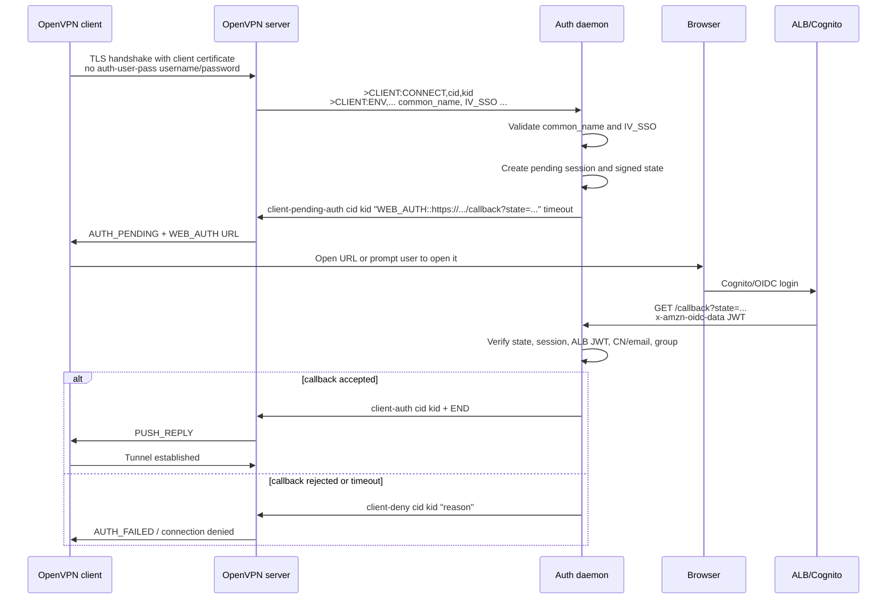

# OpenVPN WebAuth Protocol

This document is the project-local reference for the OpenVPN WebAuth flow used by `openvpn-auth-aws`.

It describes how OpenVPN, the auth daemon, the VPN client, the browser, ALB, and Cognito interact when a client is held in `AUTH_PENDING` and receives a `WEB_AUTH` URL.

## Sources Checked

External sources:

- OpenVPN management interface notes: https://openvpn.net/community-docs/management-interface.html
- OpenVPN upstream `management-notes.txt`: https://github.com/OpenVPN/openvpn/blob/master/doc/management-notes.txt
- OpenVPN 2.6 manual, including `IV_SSO`, `AUTH_PENDING`, `auth-user-pass-optional`, and `management-client-auth`: https://openvpn.net/community-docs/community-articles/openvpn-2-6-manual.html
- OpenVPN 3 web auth protocol notes: https://openvpn.github.io/openvpn3/md_doc_2webauth.html
- OpenVPN 2.7.1 release notes for `auth-user-pass username-only`: https://github.com/OpenVPN/openvpn/releases/tag/v2.7.1
- Upstream issue for `auth-user-pass username-only`: https://github.com/OpenVPN/openvpn/issues/501

How the OpenVPN3 WebAuth document applies here:

- Useful: it confirms the expected client behavior after receiving `WEB_AUTH` / deprecated `OPEN_URL`: open the URL directly or prompt the user to open it.
- Useful: it documents optional internal-webview behavior, including `embedded=true`, `hidden`, and JavaScript `postMessage` events such as `ACTION_REQUIRED`, `CONNECT_SUCCESS`, and `CONNECT_FAILED`.
- Useful for future work: it recommends auth-token usage to reduce repeated browser prompts on reconnect/reauth.
- Not used by this project today: OpenVPN web profile download, `openvpn://import-profile`, Access Server REST profile download, and WebAuth profile-import headers such as `Ovpn-WebAuth`.
- Uncertain for this project: behavior of `hidden`, `external`, `proxy`, and the optional JavaScript State API across the clients we support. These are not covered by the current lab.

Project-local references:

- [OpenVPN Server Configuration](openvpn-server.md)
- [Architecture](architecture.md)
- [Daemon Security Features](daemon-security.md)
- [OpenVPN 2.7 Migration Notes](openvpn-2.7-migration.md)

## Scope

This project uses WebAuth only for connection authentication:

```text
OpenVPN management-client-auth
  -> CLIENT:CONNECT
  -> client-pending-auth ... "WEB_AUTH::URL"
  -> client AUTH_PENDING
  -> browser OIDC callback
  -> client-auth / client-deny
```

This document does not define OpenVPN profile download APIs, OpenVPN Access Server REST APIs, `crtext` challenge/response, or proxy-assisted WebAuth. Those are described in upstream docs but are not implemented by this project.

Where upstream behavior is not confirmed by this repository's lab, this document says **uncertain** instead of guessing.

## Required OpenVPN Server Behavior

The server config must include:

```text
management /run/openvpn/management.sock unix /path/to/management-pw
management-client-auth
management-hold
auth-user-pass-optional
hand-window 300
```

Relevant meanings:

- `management-client-auth` makes OpenVPN ask the management client, this daemon, to authorize client connections after certificate verification.
- `management-hold` lets the daemon connect and issue `hold release` before OpenVPN accepts clients.
- `auth-user-pass-optional` allows clients to connect without an OpenVPN username/password even though `management-client-auth` is enabled.
- `hand-window` must be long enough for the browser login and callback. The project default is `300s`.

## Required Client Behavior

The client profile must not use static VPN username/password auth:

```text
# no auth-user-pass
push-peer-info
setenv IV_SSO webauth
```

The client still has a real client-side authentication method: its TLS client certificate and private key.

`IV_SSO` is client capability metadata. It tells the daemon whether the client supports additional authentication methods. This project accepts `webauth` and `openurl` because current code treats both as WebAuth-capable. New profiles should use `webauth`.

Do not set `IV_SSO` in the server config. It must describe the connecting client, not the server.

## End-To-End Flow



## Management Messages

OpenVPN emits a management event:

```text
>CLIENT:CONNECT,{CID},{KID}
>CLIENT:ENV,common_name=user@example.com
>CLIENT:ENV,IV_SSO=webauth
>CLIENT:ENV,...
>CLIENT:ENV,END
```

The daemon either denies immediately:

```text
client-deny {CID} {KID} "client does not support WebAuth"
```

or starts pending WebAuth:

```text
client-pending-auth {CID} {KID} "WEB_AUTH::{URL}" {TIMEOUT}
```

On success:

```text
client-auth {CID} {KID}
END
```

On failure:

```text
client-deny {CID} {KID} "reason"
```

`CID` identifies the OpenVPN client instance within one OpenVPN process. `KID` identifies the current TLS/auth key event. Use the `{CID,KID}` pair from the current management event. Do not cache a `KID` from `CLIENT:CONNECT` and reuse it for `CLIENT:REAUTH`.

## `WEB_AUTH` Extra Format

Upstream `management-notes.txt` describes the pending-auth extra data formats as:

```text
OPEN_URL:url
WEB_AUTH:flags:url
```

`OPEN_URL` is deprecated upstream because it cannot carry flags. `WEB_AUTH` is the preferred form.

This project sends an empty-flags `WEB_AUTH` value:

```text
WEB_AUTH::https://vpn-auth.example.com/callback?state=<signed-state>
```

The double colon means the flags field is empty:

```text
WEB_AUTH:<empty flags>:<url>
```

The project currently does not use upstream `WEB_AUTH` flags such as `hidden`, `external`, or `proxy`. Client behavior for those flags across all OpenVPN clients is **uncertain** for this project because it is not covered by the lab.

## Client-Side `AUTH_PENDING`

After `client-pending-auth`, OpenVPN sends an `AUTH_PENDING` signal and forwards the extra information to the client. Upstream notes say the client is expected to inform the user that authentication is pending and display the extra information. For WebAuth, OpenVPN3 docs say the client should open the URL directly or prompt the user to open it.

Practical project behavior:

- OpenVPN3 Linux opens the browser in the tested flow.
- OpenVPN 2.x CLI may only print/log the URL, depending on environment.
- OpenVPN GUI on Windows works in tested client logs.
- Ubuntu/Mint NetworkManager `network-manager-openvpn` is unsupported in this project because the observed flow did not pass `IV_SSO=webauth` or handle the `WEB_AUTH` URL.

## Callback URL And State

The daemon puts a signed state blob in the callback URL:

```text
https://vpn-auth.example.com/callback?state=<payload>.<hmac>
```

The state payload contains:

- `sid` - random session ID
- `iat` - issued-at timestamp
- `exp` - expiry timestamp

The HMAC protects the callback from forged or tampered state. The callback is accepted only if:

- the state HMAC is valid
- the state is not expired
- the pending session exists and can transition to processing
- the ALB OIDC JWT is present and valid
- the OIDC `email` claim matches the certificate CN when `--cn-cross-check=true`
- the authenticated user is in `--required-group` when configured

See [Daemon Security Features](daemon-security.md) for the full security model.

## Timeouts

There are three relevant timeout concepts:

- `client-pending-auth ... TIMEOUT` tells the client how long pending authentication may take.
- OpenVPN `hand-window` still bounds the handshake. If the server and client do not exchange the required packets in time, the connection fails.
- The daemon's signed state expires after the configured hand-window and pending sessions are reaped by `--auth-timeout`.

This project uses `hand-window=300s` and daemon `--auth-timeout=270s` by default, leaving about 30 seconds for `AUTH_FAILED` to reach the client before OpenVPN's handshake window closes.

## URL Length

Upstream `management-notes.txt` says the control message has a larger protocol limit and recommends keeping WebAuth URLs short. This project uses a stricter practical limit for OpenVPN CE clients, documented in [Architecture - WEB_AUTH URL Length Constraints](architecture.md#web_auth-url-length-constraints).

Project rule:

- keep the callback URL short
- keep callback path names short
- put only the compact signed `state` in the URL
- reject overlong URLs with `client-deny` instead of letting clients silently fail

## Reauth

`CLIENT:REAUTH` can occur during TLS renegotiation. It carries a fresh `KID` for that event:

```text
>CLIENT:REAUTH,{CID},{KID}
```

The daemon must use the current `{CID,KID}` pair when replying with `client-auth-nt`, `client-auth`, or `client-deny`.

The current project does not use OpenVPN auth-token optimization to suppress browser prompts on reconnect/reauth. Upstream OpenVPN3 docs recommend minimizing repeated WebAuth prompts with auth tokens, but this project has not implemented that mechanism. Treat auth-token behavior in this project as **not supported** unless explicitly added and tested.

## Why We Do Not Use `auth-user-pass username-only`

OpenVPN 2.7.1 added:

```text
auth-user-pass username-only
```

That client-side option asks only for a username and sends a dummy password. It is useful for SSO-only or certificate-less designs where `auth-user-pass` is used as a compatibility shim and the username seeds an external challenge.

This project does not use it because:

- the client already has a TLS client certificate and private key
- `auth-user-pass-optional` lets the client omit username/password
- identity starts from certificate CN
- browser OIDC identity is bound back to CN by `--cn-cross-check`
- adding an OpenVPN username would introduce a second user-supplied identity field without improving the current model

See [OpenVPN Server Configuration](openvpn-server.md#why-we-do-not-use-auth-user-pass-username-only).

## Known Uncertainties

- Exact WebAuth UI behavior varies by OpenVPN client and platform. Some clients open a browser, some display a URL, and some integrations do not support the flow.
- This project has not validated upstream `WEB_AUTH` flags such as `hidden`, `external`, or `proxy`.
- This project has not implemented or tested auth-token-based WebAuth suppression on reauth/reconnect.
- This project does not claim compatibility with certificate-less OpenVPN WebAuth designs.
